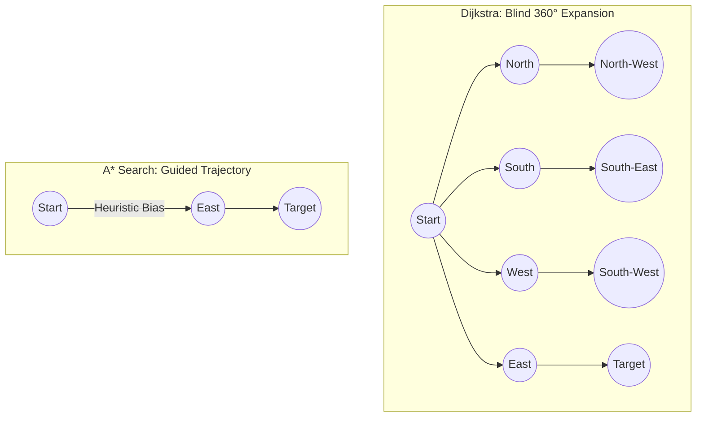
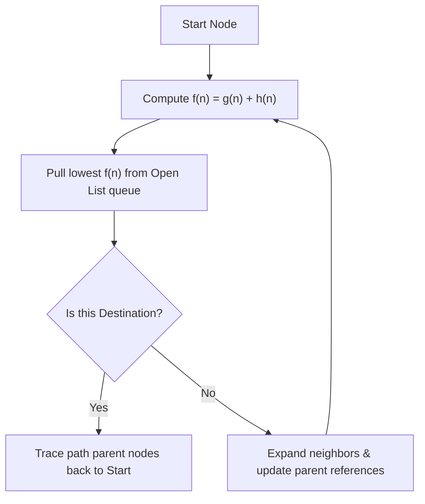

Is pathfinding in games a mystery of complex physics grids? No.  
Is it just adding a heuristic distance bias to Dijkstra's search? Hell yes.

Think about playing a strategy game like *Age of Empires* or *Starcraft*. You click on the other side of a sprawling, obstacle-filled map, and a group of 50 units instantly navigates around forests, cliffs, and walls to reach the target location. They do this in real-time, for dozens of players simultaneously, without causing your computer's framerate to drop by a single frame.

If the game engine ran a standard Dijkstra or Breadth-First search, your CPU would freeze. Searching a large grid in every direction equally would require evaluating millions of nodes per click.

Here is how the **A* Search Algorithm** uses a simple mathematical heuristic to guide pathfinding directly to the target at 60 FPS.

---

## The Dijkstra Gridlock: Why Breadth-First Fails

Dijkstra’s algorithm is mathematically perfect. It is guaranteed to find the absolute shortest path from point A to point B by exploring nodes in concentric circles. 

But this perfection has a massive computational cost: **it is directionally blind**.



If your destination is directly to the east, Dijkstra will still spend CPU cycles exploring paths to the north, south, and west. It behaves like a drop of water spreading on a napkin—it has to flood the entire space to find the exit. On a $1000 \times 1000$ game grid, this means checking up to a million coordinates for a simple path.

---

## The Heuristic Magic: Guiding the Frontier

A* resolves this directional blindness by adding a **Heuristic Function** (an educated guess) to Dijkstra's scoring system.

Every node evaluated by A* is assigned a total cost score $f(n)$ using this equation:

$$f(n) = g(n) + h(n)$$

*   **$g(n)$ (Actual Cost)**: The exact distance traveled from the start node to the current node. This prevents the pathfinder from taking ridiculously long detours.
*   **$h(n)$ (Heuristic Cost)**: The estimated distance from the current node to the destination. This is the "magic guess" that guides the search.

By adding $h(n)$ to the score, we penalize nodes that move away from the destination. The search frontier transforms from a expanding circle into a directed beam targeting the destination.



---

## The Tricky Part: Calculating Distance Heuristics

The heart of A* is the heuristic calculation. If your heuristic is too optimistic (underestimates distance), the search behaves like Dijkstra—slow but accurate. If it is too pessimistic (overestimates distance), the search runs incredibly fast but might return a suboptimal, crooked path.

For grid-based layouts, we calculate distances using **Manhattan Distance** (for 4-direction grids) or **Euclidean Distance** (for free-movement grids):

```javascript
// Heuristic calculations for grid coordinates
const Heuristics = {
  // 1. Manhattan Distance (Use when only moving Up, Down, Left, Right)
  manhattan: (node, target) => {
    return Math.abs(node.x - target.x) + Math.abs(node.y - target.y);
  },

  // 2. Euclidean Distance (Use when moving in any angle/diagonal)
  euclidean: (node, target) => {
    const dx = node.x - target.x;
    const dy = node.y - target.y;
    return Math.sqrt(dx * dx + dy * dy);
  }
};

// Node evaluation selection gate
function evaluateNode(neighbor, current, target) {
  const moveCost = 1; // Standard grid step cost
  const tentativeGScore = current.g + moveCost;

  if (tentativeGScore < neighbor.g) {
    neighbor.parent = current;
    neighbor.g = tentativeGScore;
    // The Heuristic guides f(n) directly toward the target coordinate
    neighbor.h = Heuristics.manhattan(neighbor, target);
    neighbor.f = neighbor.g + neighbor.h;
  }
}
```

> [!TIP]
> **Avoid Math.sqrt in Loops**: Computing `Math.sqrt` on every node check is extremely CPU-expensive. If you are using Euclidean distance for your heuristic, use the **squared Euclidean distance** ($dx^2 + dy^2$) instead. As long as you scale your $g(n)$ values proportionally, the pathfinder will prioritize the exact same nodes without running expensive square root operations!

---

## Threat Vector Matrix: Heuristic Design Trade-offs

Choosing the wrong heuristic function can break your pathfinding execution speeds or produce bizarre, zig-zag NPC paths:

| Heuristic Function | Movement Allowed | Path Shape | CPU Overhead | Suboptimal Risk |
| :--- | :--- | :--- | :--- | :--- |
| **Manhattan ($dx + dy$)** | 4-way (Orthogonal) | L-shaped corridors | **Very Low** | Zero |
| **Diagonal (Chebyshev)** | 8-way (Includes diagonals) | Diagonal slices | Low | Zero |
| **Euclidean ($\sqrt{dx^2 + dy^2}$)** | Free angles (360 degrees) | Straight lines | **High (Square root)** | Zero |
| **Overconsistent ($h(n) \times 2$)** | Any | Highly directed | Very Low | High (Cuts corners) |

👉 **[Download the A* Pathfinding visualizer on GitHub](https://github.com/itishacodes/MindDump)**

---
