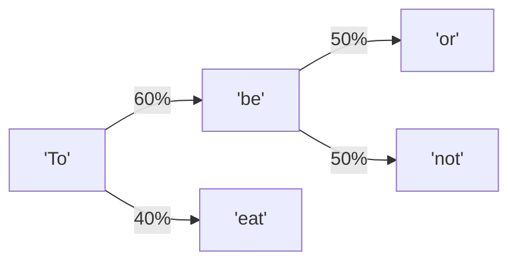

Do you need billions of parameters to generate readable sentences? No.  
Can a simple state transition matrix write fake Shakespeare? Hell yes.

In the era of ChatGPT, we are accustomed to massive Large Language Models that cost millions of dollars to train. We assume that generating coherent text requires deep neural networks, transformer attention layers, and massive parameter weights.

But text generation has a much older, simpler history.

In 1906, Russian mathematician Andrey Markov developed a mathematical model called the **Markov Chain**. He proved that you can generate surprisingly readable, contextually structured text using nothing but basic probability matrices.

Here is how you can build a client-side text generator in vanilla JavaScript that reads a block of text and writes its own "fake Shakespeare" using probability.

---

## The Markov Concept: The Memoryless Sequence

A Markov Chain is a **memoryless state transition machine**. 

The fundamental rule of a Markov system is simple: *“The probability of the next state depends only on the current state, not on the history of how you got there.”*

In NLP text generation, a state is a word (or a pair of words). We read a text corpus (like *Hamlet*) and analyze which words follow which other words.



If the current state word is `"To"`, our database might tell us that in our training text, the word `"be"` follows it 60% of the time, and the word `"eat"` follows it 40% of the time. The generator rolls a random number, selects the next word based on these probabilities, and moves to that new word as the current state.

---

## The Transition Dictionary: Mapping Word Chains

To build this in JavaScript, we parse our text corpus into a dictionary where the keys are **word pairs** (to preserve basic context) and the values are lists of words that follow them:

```typescript
// Tricky Part: Parsing text into a second-order transition dictionary
function buildMarkovModel(text) {
  const words = text.split(/\s+/).filter(w => w.length > 0);
  const model = {};

  for (let i = 0; i < words.length - 2; i++) {
    // We use a 2-word key (bigram) to preserve context flow
    const key = `${words[i]} ${words[i + 1]}`;
    const nextWord = words[i + 2];

    if (!model[key]) {
      model[key] = [];
    }
    model[key].push(nextWord);
  }
  return model;
}

// Text Generation: Random walk through the model
function generateText(model, wordCount = 50) {
  const keys = Object.keys(model);
  const startKey = keys[Math.floor(Math.random() * keys.length)];
  let currentWords = startKey.split(" ");
  let output = [...currentWords];

  for (let i = 0; i < wordCount - 2; i++) {
    const key = `${currentWords[0]} ${currentWords[1]}`;
    const nextWordList = model[key];

    // Fallback if we hit a dead end
    if (!nextWordList || nextWordList.length === 0) break;

    // Pick the next state based on frequency probability
    const nextWord = nextWordList[Math.floor(Math.random() * nextWordList.length)];
    output.push(nextWord);
    
    // Slide context window forward
    currentWords = [currentWords[1], nextWord];
  }
  return output.join(" ");
}
```

> [!TIP]
> **Use Higher-Order Chains for Coherence**: A 1st-order Markov chain (predicting the next word from a single current word) produces chaotic gibberish. A 2nd-order chain (using a 2-word key, as shown above) preserves phrases. A 3rd-order chain (using 3-word keys) starts outputting sentences that look almost identical to the source text!

---

## Text Generation Evolution Scorecard

Comparing the progression of natural language generation models highlights how transformers eventually solved the memory horizon limitation:

| Model Architecture | Context Memory Horizon | Output Coherence | Resource Cost | Setup Complexity |
| :--- | :--- | :--- | :--- | :--- |
| **Markov Chains** | 1-2 words | Low (Hilarious gibberish) | **Zero (Runs in ms)** | Zero |
| **Recurrent Nets (RNN/LSTM)** | 10-20 words | Medium | Low | Medium |
| **Transformers (Attention)** | **Millions of words** | **Human-grade** | **Extremely High** | High |

While Markov Chains cannot write essays or compile code, they are incredibly efficient for generating mock data, creative text bots, and procedural game items for $0 of hosting fees.

👉 **[Download the Markov Text Generator on GitHub](https://github.com/itishacodes/MindDump)**

---
