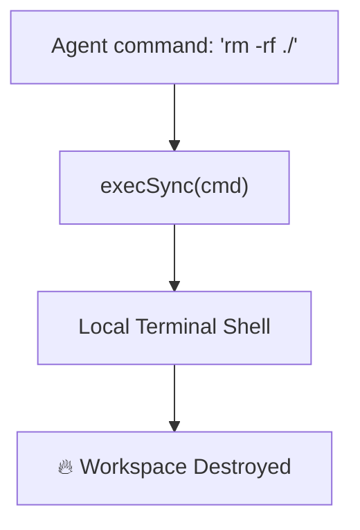

Was I tired of writing nested if-else statements to route complex user tasks? Yes.  
Did I build an autonomous ReAct loop in 40 lines of JavaScript that routes itself? Hell yes.

It was 2:00 AM on a Tuesday. I had 47 Chrome tabs open, my terminal was throwing a cryptic `Webpack compile error: Module build failed (from ./node_modules/babel-loader)` due to some nested peer dependency conflict, and my brain was running on 90% caffeine. The standard developer workflow here is obvious: copy the stack trace, paste it into ChatGPT, get a suggestion, run the command, get another error, copy-paste again, and repeat this manual cycle until the compiler stops screaming.

But then I thought: *Why am I playing the role of a copy-paste clipboard proxy?* 

If the compiler can output errors to stdout, and a script can execute shell commands, why not let the LLM talk directly to the terminal shell? Instead of importing a massive, bloated AI agent framework that drags in half of npm, I decided to write a lightweight, autonomous **ReAct (Reason + Act)** loop from scratch in under 40 lines of clean Node.js. 

Here is how I designed an agent loop that runs files, catches errors, and argues with itself until the build passes.

---

## The Architect's Dilemma: The Bloat of Modern Frameworks

If you read modern AI engineering forums, you’d think building an "agent" requires downloading a mountain of framework code:
* **The Dependency tax**: Pre-built agent libraries drag in hundreds of dependencies. They add massive wrappers around basic fetch calls, meaning your simple prompt is now buried under 15 layers of abstract call-stack classes. Good luck debugging a rate limit error when the framework intercepts and swallows the HTTP response code.
* **The Abstraction Trap**: Frameworks try to be "model agnostic" by creating complex configuration schemas for prompts. The result? Instead of writing a clean, readable template literal in JavaScript, you have to configure nested YAML/JSON structures just to tell the system how to format a list.
* **State Monopoly**: When an agent library manages the state loop internally, you lose visibility. You can't easily hook into the loop to log *why* the model made a decision, or inspect the exact raw prompts being sent over the wire.

I wanted a zero-dependency architecture. I wanted to see the raw text stream from the model, parse the exact commands it generated, and execute them on my local file system with absolute transparency.

---

## Inside the State Machine: The Anatomy of a ReAct Loop

The foundation of autonomous agency is the **ReAct (Reasoning and Acting)** framework, originally detailed by Yao et al. It breaks down LLM execution into a continuous loop of three simple states:

1.  **Thought**: The model reasons about the user request and its current context (*"The compiler says Babel is missing a plugin, I need to read the package.json file to inspect the dependencies."*).
2.  **Action**: The model decides to run a tool, formatting its intent as a parseable command (*"Action: read_file[path='package.json']"*).
3.  **Observation**: The environment executes the tool and outputs the raw result directly back into the conversation history (*"Observation: { 'dependencies': { ... } }"*).

This loop repeats until the model decides it has the final answer.

```mermaid
graph TD
    subgraph Execution Loop (Node.js Controller)
        A["User Input: 'Fix compiler error'"] --> B["System Prompt (Enforce Thought/Action/Observation)"]
        B --> C["LLM Call (Generate Text Stream)"]
        C --> D["Parse Stream (Detect Thought & Action)"]
        D --> E{"Action Type?"}
        E -- "Tool Call (e.g., execute_command)" --> F["Run Local Function (execSync)"]
        F --> G["Get Output (stdout/stderr)"]
        G --> H["Append to Prompt: 'Observation: ...'"]
        H --> C
        E -- "Final Answer" --> I["Print Result to Console"]
      end
```

> [!NOTE]
> **Planning Token Math**: Why does the model think out loud *before* doing things? Because it uses **Autoregressive Text Generation**. If you force the model to output the `Action` immediately, its attention heads only have access to your system prompt. By forcing it to write a `Thought` first, the attention heads can reference its own newly generated tokens, allowing it to "plan" its vector path step-by-step.

---

## Escape Velocity: Stopping the Infinite Execution Loop

During my first live test, I gave the agent a script with a missing bracket and ran it. 

The agent analyzed the error, wrote a fix to the file, and executed the compiler. But the agent made a syntax typo in the fix. The compiler failed again. 

Here is what the loop logs looked like:
```text
Thought: The build failed because 'app' is undefined. I will add an import statement.
Action: write_file[path="server.js", content="const app = require('./app');"]
Observation: Compile failed: require(...) is not a function.

Thought: Ah, the import is incorrect. I should import it as default.
Action: write_file[path="server.js", content="const app = require('./app');"]
Observation: Compile failed: require(...) is not a function.

Thought: Let me try importing it again.
Action: write_file[path="server.js", content="const app = require('./app');"]
```

The agent got stuck in an **infinite loop trap**, burning through API tokens trying the same failing code forever. 

To solve this, I built a lightweight **Loop Guard** directly inside the JavaScript runner. The runner hashes every action and its parameters. If the same hash is registered more than twice, the runner intercepts the loop and injects a high-priority warning directly into the prompt history, forcing the model to re-evaluate its pathing:

```javascript
class LoopGuard {
  constructor(maxRepeats = 2) {
    this.history = new Map();
    this.maxRepeats = maxRepeats;
  }

  registerAndCheck(action, params) {
    const hash = `${action}:${JSON.stringify(params)}`;
    const count = (this.history.get(hash) || 0) + 1;
    this.history.set(hash, count);

    if (count > this.maxRepeats) {
      return {
        isLooping: true,
        warning: `System Notification: You have executed the action "${action}" with parameters ${JSON.stringify(params)} multiple times, and it is still failing. DO NOT run this action again. Try an alternative file edit or run a diagnostic command to inspect your assumptions.`
      };
    }
    return { isLooping: false };
  }
}
```

---

## The Critic Protocol: Letting Agents Argue in Console

Instead of running a single agent loop that blindly commands your terminal, a more robust architecture is a **Multi-Agent Critic Loop**. In this design, we spawn two distinct agents with clashing prompts:

*   **The Developer Agent**: Tasked with writing code and resolving errors. It has access to writing and execution tools.
*   **The Compiler Critic Agent**: Tasked with finding loopholes, syntax issues, and potential edge-case failures in the Developer Agent's outputs. It has *zero* write permissions—it can only read code and inspect outputs.

Here is a look at what happens when you set up these two agents inside a terminal execution gate:

```text
[DevAgent] Thought: I need to fetch user profiles. I will write a simple fetch call.
[DevAgent] Action: write_file[path="api.js", content="const res = await fetch('/users');"]

[CriticAgent] Thought: The DevAgent wrote an asynchronous 'await' fetch call but didn't wrap it inside an 'async' function scope. This will throw a SyntaxError at runtime.
[CriticAgent] Action: send_warning[msg="Line 1: Top-level await is not supported in this Node environment configuration. Wrap it in an IIFE or async function."]

[DevAgent] Thought: Ah, the critic is correct. I forgot the Node ES module environment boundaries. Let me rewrite.
[DevAgent] Action: write_file[path="api.js", content="async function run() { const res = await fetch('/users'); }"]
```

By separating concerns—one agent focusing entirely on creative code edits, and the other focusing entirely on syntax validation—we drastically reduce compile failures before commands ever touch your shell.

---

## Sandbox Security: Taming `execute_command`

Giving an AI model access to `execute_command` (which uses Node's `execSync` or `spawn` under the hood) is like giving a stranger SSH keys to your laptop. It is a massive security hazard. If the LLM hallucinates, it can run commands like `rm -rf /` or leak your `.env` variables via `curl`. 



### How to Build a Local Sandbox:
1.  **Command Whitelisting**: Never pass raw strings directly to your shell. Check every command against a whitelist Regex:
    ```javascript
    const SAFE_COMMAND_REGEX = /^(npm run build|npm test|node app\.js)$/;
    if (!SAFE_COMMAND_REGEX.test(cmd)) {
      return "Security Error: Command execution rejected. You are only allowed to run build or test scripts.";
    }
    ```
2.  **Docker Isolation**: Always run your developer agents inside an isolated Docker container with zero access to your host machine's environment variables and mounted directories.
3.  **Read-Only Mounts**: If the agent only needs to analyze code structures, mount your directory as read-only.

> [!TIP]
> **Pro-Tip on JSON Parameters**: Standard bracket parser regexes can fail if the LLM writes multi-line string content (like JSON config code blocks) inside parameters. To keep parser execution rock-solid, instruct the model to write code parameters in escaped single-line strings or base64 format, then decode them locally inside the tool functions.

👉 **[Download the ReAct Agent repository on GitHub](https://github.com/itishacodes/MindDump)**

---
