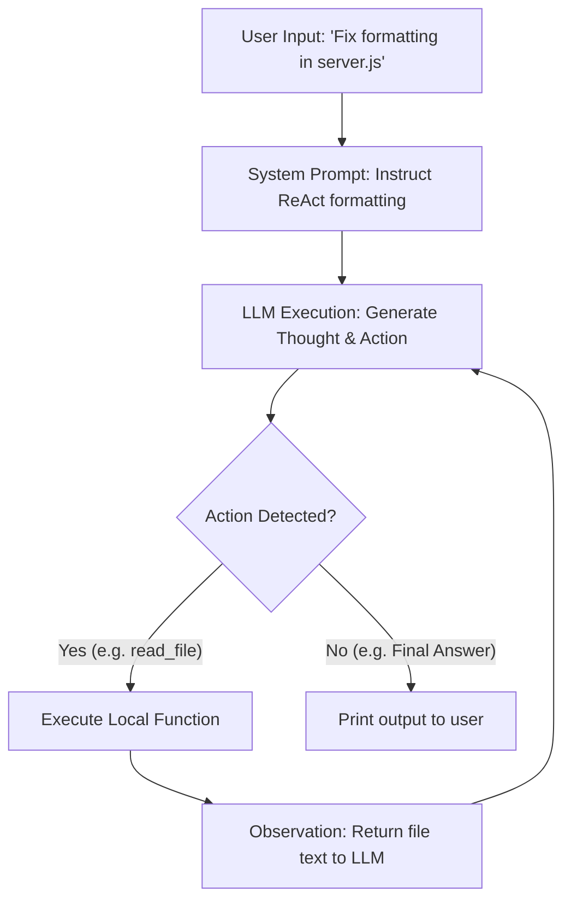

Was I tired of writing nested if-else statements to route complex user tasks? Yes.  
Did I build an autonomous ReAct loop in 40 lines of JavaScript that routes itself? Hell yes.

We are often told that building autonomous AI agents requires importing heavy enterprise frameworks. But pulling in hundreds of dependencies just to run a simple decision-making loop is a complete vibe-kill. 

Here is how I built a raw **ReAct (Reason + Act)** agent loop from scratch in pure Node.js to automate terminal debugging.

---

## 😩 The Friction (The Bloat of Agent Frameworks)

When building traditional software, you have to write hardcoded if-else paths for every scenario:
* **The Routing Nightmare**: If the user wants a database count, call `queryDB()`. If they want local files, call `readDisk()`. The moment you add 10+ tools, your API controller becomes a house of cards.
* **Framework Lock-in**: Modern agent libraries drag in heavy runtimes, abstracting away the actual prompt templates and network calls.
* **Invisible Failures**: When a pre-built agent fails, debugging the nested state tree is a nightmare.

I wanted a clean, transparent loop where the model thinks, acts, and corrects its own mistakes in plain terminal logs.

---

## ⚡ The Technical Blueprint (The ReAct Loop)

The **ReAct** pattern combines reasoning (thoughts) and actions (calling tools) in a clean, iterative state machine:



* **The Thought**: The LLM analyzes the current state and writes down its reasoning path (`Thought: I need to inspect the file content...`).
* **The Action**: The model selects a tool and writes a structured command block (`Action: read_file[path="server.js"]`).
* **The Observation**: Our parser executes the local function and feeds the output back into the prompt buffer (`Observation: const x = ...`).

---

## 💣 The Plot Twist (The Infinite Loop Trap)

During early testing, I gave the agent a file with a syntax error and asked it to fix it. 

The agent read the file, wrote a fix, ran the build, saw the build failed, and then... wrote the exact same incorrect fix again. It entered an **infinite loops trap**, burning through API tokens at 100 requests per minute trying the same failing code forever!

#### The Fix
Instead of trusting the LLM to realize it was stuck, I built a lightweight **state history tracker** directly into the execution loop. If the agent executes the exact same tool with the exact same parameters three times in a row, we force-inject a high-priority warning into the context:

```javascript
let loopCounter = {};

function executeLoopStep(thoughtAction) {
    const actionKey = `${thoughtAction.action}:${JSON.stringify(thoughtAction.params)}`;
    loopCounter[actionKey] = (loopCounter[actionKey] || 0) + 1;

    // Detect repeat iterations
    if (loopCounter[actionKey] >= 3) {
        return "System Warning: You have tried this action 3 times and it keeps failing. Stop repeating. Try a different approach or output your final answer.";
    }

    return executeTool(thoughtAction.action, thoughtAction.params);
}
```

---

## 💡 Pro-Tips & Mental Models

> [!TIP]
> **Pro-Tip on Parser Reliability**: Always prompt your agent to output tools using standard formats (like JSON blocks). Avoid parsing arbitrary markdown text with custom regex; it will break the moment the model tweaks its adjectives.

> [!NOTE]
> **Fun Fact on System Prompts**: Instructing the model to write a `Thought` *before* outputting its `Action` gives it time to compute tokens, drastically increasing accuracy compared to immediately forcing a tool call output.

---

## 🚀 Key Takeaways & Live Playground

* **Build Your Own State Loops**: You don't need heavy agent frameworks to build smart routers. A clean 40-line `while` loop is faster and easier to debug.
* **Track Loop Iterations**: Never let an LLM run indefinitely without loop limits and repeat-action detectors.
* **Chain of Thought**: Giving models a scratchpad (`Thought:`) to reason out loud improves decision-making paths.

👉 **[Inspect the ReAct Agent codebase on GitHub](https://github.com/itishacodes/MindDump)**

---
