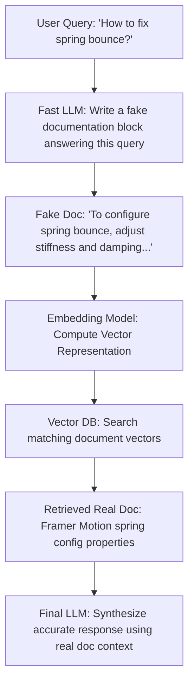

Did we build a multi-million-node vector search database only for our LLM to confidently make up fake statistics anyway? Yes.  
Did generating fake answers first solve it? Hell yes.

It was 1:00 AM. I was working on a search assistant for my coding portfolio. I had successfully chunked all my project documentation, computed high-dimensional vector embeddings, and loaded them into a vector database. It was the textbook **Retrieval-Augmented Generation (RAG)** pipeline.

I opened the chat console and typed: *“How do I configure the spring physics stiffness parameters to eliminate bounce?”*

Instead of pulling the exact documentation chunk for my animation configurations, the vector search returned a general CSS transitions guide and a troubleshooting note about page layout lag. Because the retrieved context was completely useless, the LLM did what LLMs do best: it confidently hallucinated a series of fake JSON physics keys that don't exist in my codebase, completely gaslighting me about my own code!

Here is how I used **HyDE (Hypothetical Document Embeddings)** to force my vector search to find the correct documents every single time.

---

## 😩 The Friction (The Math Behind Why Standard RAG Fails)

Standard RAG operates on a simple, flawed premise: *“A user’s search query looks semantically similar to the documentation chunk containing the answer.”*

If you inspect how vector embedding models work, you quickly realize why this assumption breaks down:
* **The Asymmetric Vocabulary Gap**: A user query is short, fragmented, and interrogative (*"how to fix spring bounce"*). The target documentation is long, declarative, and highly technical (*"The motion module interface exposes stiffness and damping coefficients to regulate mechanical momentum..."*). In a vector space, these two blocks of text occupy entirely different manifolds because their syntax, length, and sentence structures are mismatched.
* **Semantic Drift**: High-dimensional embedding spaces naturally group questions with other questions, and answers with other answers. When you embed a raw question, the vector database frequently pulls *other questions* from your dataset rather than the declarative paragraphs that actually answer them.
* **Low Signal-to-Noise Ratio**: If your query retrieves the wrong context chunks, the LLM has no choice but to extrapolate from thin air, leading to the dreaded "hallucination spiral."

---

## ⚡ The Technical Blueprint (The HyDE Concept)

To bridge the gap between questions and answers, researchers (Gao et al.) introduced **HyDE (Hypothetical Document Embeddings)**. 

Instead of embedding the user's raw query, the pipeline does this:
1.  **Generate a Fake Document**: We feed the query to a fast, cheap LLM (like Gemini Flash) and tell it to write a *hypothetical, fake answer* page. We don't care if the facts in this fake document are wrong—we only care about its **format, style, and vocabulary**.
2.  **Embed the Fake Document**: We run this hypothetical answer through our embedding model.
3.  **Perform Vector Search**: We search the vector database using the embedding of the *fake answer*.
4.  **Synthesis**: We feed the *real* retrieved documents to our main LLM to generate the final, factual response.

By searching with a fake *answer* instead of a raw *question*, we align the vector manifolds. The fake answer shares the same length, vocabulary, and declarative shape as the real documents in our database, making the vector search dramatically more accurate.



---

## 💣 The Plot Twist (The Hallucination Cascade)

But here is where things go wrong: what happens if the first LLM generates a hypothetical document that is so wildly incorrect that it steers the vector search into a completely wrong section of your database? 

For example, if the user asks: *“How do I handle page splits in high-write nodes?”* (referring to database indexing overhead).
If the first LLM hallucinates that this is a query about *PDF printing margins*, it will generate a fake document about *CSS print margins and page breaks*. Your vector search will then retrieve formatting docs instead of database performance tuning guides. This is a **Hallucination Cascade**.

#### The Code Guardrails
To prevent a hallucination cascade, we implement two engineering rules:
1.  **Zero-Creativity Generation**: Set the LLM temperature to `0.0` or `0.1` and use a highly constrained system prompt to prevent the model from adding creative fluff.
2.  **Cosine Score Fallback**: We evaluate the similarity score of the top retrieved document. If the cosine similarity is below a threshold (e.g. `0.70`), we discard the hypothetical document and fall back to searching with the user’s original raw query.

---

## 🛠️ The Complete Codebase Blueprint

Here is a clean, production-grade Node.js implementation of the HyDE retrieval pipeline using the Google Gen AI SDK. It demonstrates how to generate the fake document, embed it, search a local index, and handle similarity fallback guards:

```javascript
import { GoogleGenAI } from "@google/genai";

// 1. Initialize Gen AI Client
const ai = new GoogleGenAI({ apiKey: process.env.GEMINI_API_KEY });
const LLM_MODEL = "gemini-2.5-flash";
const EMBEDDING_MODEL = "text-embedding-004";

// 2. Mock Vector Database Chunks
const mockVectorDatabase = [
  {
    id: "spring-physics-doc",
    text: "Framer Motion spring physics settings let you control stiffness (tension) and damping (friction). Adjust stiffness to increase velocity, and damping to eliminate bounce.",
    vector: [] // Populated during initialization
  },
  {
    id: "postgres-indexing-doc",
    text: "PostgreSQL B-Tree indexes optimize query speeds for range and equality searches. High-write databases should monitor page splits and indexing overhead.",
    vector: []
  },
  {
    id: "react-hydration-doc",
    text: "React hydration mismatch errors happen when server-rendered HTML doesn't match client state. Wrap window checks in useEffect hooks to gate execution.",
    vector: []
  }
];

// Helper: Compute Cosine Similarity between two arrays
function cosineSimilarity(vecA, vecB) {
  let dotProduct = 0;
  let normA = 0;
  let normB = 0;
  for (let i = 0; i < vecA.length; i++) {
    dotProduct += vecA[i] * vecB[i];
    normA += vecA[i] * vecA[i];
    normB += vecB[i] * vecB[i];
  }
  return dotProduct / (Math.sqrt(normA) * Math.sqrt(normB));
}

// 3. Populate Database Vectors
async function initializeDb() {
  for (const chunk of mockVectorDatabase) {
    const response = await ai.models.embedContent({
      model: EMBEDDING_MODEL,
      contents: chunk.text
    });
    chunk.vector = response.embedding.values;
  }
  console.log("✅ Mock Vector Database Initialized.\n");
}

// 4. Executing the HyDE Pipeline
async function queryHyde(userQuery) {
  console.log(`🔎 User Query: "${userQuery}"`);

  // Step A: Generate Hypothetical Document (Low Temperature)
  const fakeDocResponse = await ai.models.generateContent({
    model: LLM_MODEL,
    contents: `Write a single-paragraph technical documentation template that answers this query: "${userQuery}". Do not explain anything, just output the documentation template.`,
    config: {
      temperature: 0.1 // Force clean structure, suppress creative deviations
    }
  });

  const hypotheticalDoc = fakeDocResponse.text;
  console.log(`🤖 Hypothetical Document:\n"${hypotheticalDoc.trim()}"\n`);

  // Step B: Embed the Hypothetical Document
  const fakeEmbeddingResponse = await ai.models.embedContent({
    model: EMBEDDING_MODEL,
    contents: hypotheticalDoc
  });
  const hypotheticalVector = fakeEmbeddingResponse.embedding.values;

  // Step C: Perform Similarity Search
  let matches = mockVectorDatabase.map(chunk => ({
    id: chunk.id,
    text: chunk.text,
    score: cosineSimilarity(hypotheticalVector, chunk.vector)
  }));
  matches.sort((a, b) => b.score - a.score);

  console.log(`🎯 HyDE Vector Matches:`);
  matches.forEach(m => console.log(` - [${m.id}] Score: ${m.score.toFixed(4)}`));

  // Step D: Guardrail Check (Fallback to raw query if scores are too low)
  const FALLBACK_THRESHOLD = 0.70;
  if (matches[0].score < FALLBACK_THRESHOLD) {
    console.log(`\n⚠️ Warning: HyDE match confidence is low (${matches[0].score.toFixed(4)}). Falling back to Raw Query Search...`);
    
    const rawEmbeddingResponse = await ai.models.embedContent({
      model: EMBEDDING_MODEL,
      contents: userQuery
    });
    const rawVector = rawEmbeddingResponse.embedding.values;

    matches = mockVectorDatabase.map(chunk => ({
      id: chunk.id,
      text: chunk.text,
      score: cosineSimilarity(rawVector, chunk.vector)
    }));
    matches.sort((a, b) => b.score - a.score);

    console.log(`🎯 Raw Query Vector Matches:`);
    matches.forEach(m => console.log(` - [${m.id}] Score: ${m.score.toFixed(4)}`));
  }

  return matches[0];
}
```

---

## 💡 Pro-Tips & Mental Models

> [!TIP]
> **Pro-Tip on Cosine Similarity**: Always normalize your database vectors at write-time! If you normalize all vectors to unit length ($\|V\| = 1$), you can skip computing square roots during runtime similarity calculations. The cosine similarity formula simplifies to a basic dot product ($A \cdot B$), which is significantly faster and uses less CPU during search queries.

> [!NOTE]
> **Fun Fact on Embedding Space Dimensions**: Standard embedding models map text into vectors with **768 to 1536 dimensions**. In these high-dimensional spaces, words like "how", "why", and "what" create distinct vector clusters, which is why formatting discrepancies (question vs. answer) cause queries to drift away from target documentation chunks.

---

## 🚀 Key Takeaways & Live Playground

* **Structure Over Content**: HyDE works because the generated fake document matches the *semantic shape, vocabulary, and length* of your database documents, bridging the interrogative-to-declarative gap.
* **Secure Your Pipeline**: Always enforce low generation temperatures and set similarity score fallbacks to prevent hallucination cascades from pulling incorrect data.
* **Keep Embeddings Fast**: Offloading hypothetical generation to fast, cheap models (like Gemini Flash) keeps user response latency low while increasing search accuracy.

👉 **[Download the RAG & HyDE implementation repository on GitHub](https://github.com/itishacodes/MindDump)**

---
