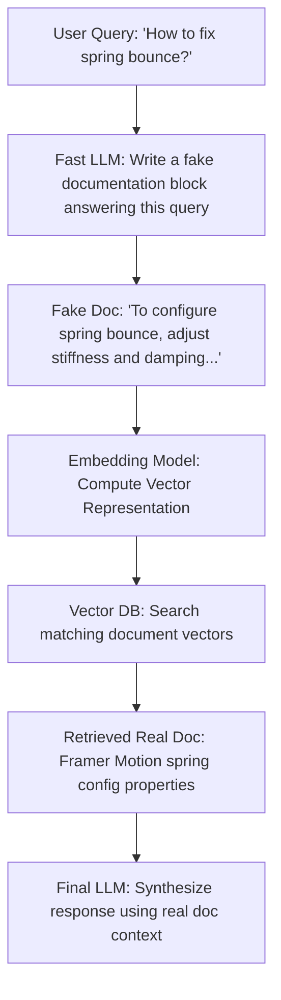

Did we build a multi-million-node vector search database only for our LLM to confidently make up fake statistics anyway? Yes.  
Did generating fake answers first solve it? Hell yes.

It was 1:00 AM. I was working on a search assistant for my coding portfolio. I had successfully chunked all my project documentation, computed high-dimensional vector embeddings, and loaded them into a vector database. It was the textbook **Retrieval-Augmented Generation (RAG)** pipeline.

I opened the chat console and typed: *“How do I configure the spring physics stiffness parameters to eliminate bounce?”*

Instead of pulling the exact documentation chunk for my animation configurations, the vector search returned a general CSS transitions guide and a troubleshooting note about page layout lag. Because the retrieved context was completely useless, the LLM did what LLMs do best: it confidently hallucinated a series of fake JSON physics keys that don't exist in my codebase, completely gaslighting me about my own code!

Here is how I used **HyDE (Hypothetical Document Embeddings)** to force my vector search to find the correct documents every single time.

---

## The Asymmetry Trap: Why Vector Search Fails Confused Users

Standard RAG operates on a simple, flawed premise: *“A user’s search query looks semantically similar to the documentation chunk containing the answer.”*

In the real world, this assumption falls flat due to the **Asymmetric Vocabulary Gap**. When a user types a query like *"how to fix spring bounce"*, it’s short, interrogative, and full of keywords. But the target documentation is long, declarative, and uses formal language (*"The motion module interface exposes stiffness and damping coefficients to regulate mechanical momentum..."*).

In a high-dimensional vector space, these two blocks of text occupy completely different manifolds. Embedding models naturally group questions with other questions, and answers with other answers. So when you search with a raw question, you're more likely to pull other questions rather than the actual answers.

> [!NOTE]
> **Understanding Dimensions**: Standard embedding models map text into vectors with **768 to 1536 dimensions**. In these high-dimensional spaces, words like "how", "why", and "what" create distinct vector clusters, causing questions to drift away from target documentation chunks.

---

## The HyDE Protocol: Building a Semantic Translation Layer

To bridge the gap between questions and answers, we can use a pattern called **HyDE (Hypothetical Document Embeddings)**, detailed in research by Gao et al. 

Instead of searching the vector database with the user’s raw question, we add a translation step: we ask a fast, cheap model (like Gemini Flash) to write a *hypothetical answer* first. We don't care if the facts in this fake answer are 100% correct; we just need its **format, style, and vocabulary**. 

Then we embed that fake answer and use **it** to search the database.



Because the fake answer is structured as a declarative paragraph, its embedding vector aligns perfectly with the real documents in our database, making the search incredibly accurate.

---

## The Fallback Gate: Dodging the Hallucination Cascade

While HyDE is incredibly powerful, it introduces a new risk: **The Hallucination Cascade**. If the user asks a highly specific query and the first LLM hallucinates a fake answer that is completely wrong, it will steer the vector search into a completely wrong neighborhood of your database.

To guard against this, we enforce two strict boundaries:
1.  **Zero-Creativity Generation**: Set the LLM temperature to `0.0` or `0.1` and use a highly constrained system prompt to prevent the model from adding creative fluff.
2.  **Cosine Score Fallback**: We evaluate the similarity score of the retrieved chunks. If the cosine similarity of the top match is below a threshold (e.g. `0.70`), we discard the hypothetical document and fall back to searching with the user’s original raw query.

Here is the exact code gate to prevent this cascade at query time:

```javascript
// 1. Embed the hypothetical document generated by the LLM
const fakeEmbedding = await embedder.embed(hypotheticalDoc);
let results = await vectorDb.query(fakeEmbedding, { limit: 3 });

// 2. Fallback Gate: Discard fake doc if search similarity score is too low
const FALLBACK_THRESHOLD = 0.70;
if (results[0].score < FALLBACK_THRESHOLD) {
    console.log(`⚠️ HyDE confidence is low (${results[0].score}). Falling back to Raw Query...`);
    const rawQueryEmbedding = await embedder.embed(userQuery);
    results = await vectorDb.query(rawQueryEmbedding, { limit: 3 });
}
```

> [!TIP]
> **Performance Optimization**: Always normalize your database vectors at write-time! If you normalize all vectors to unit length ($\|V\| = 1$), you can skip computing square roots during runtime similarity calculations. The cosine similarity formula simplifies to a basic dot product ($A \cdot B$), which is significantly faster and uses less CPU during search queries.

---

## Decoupling Knowledge: Search Architectures compared

When building a codebase search or knowledge retrieval system, HyDE is just one tool in the toolkit. Here is a comparison of different retrieval patterns:

| Metric | Keyword Search (BM25) | Standard RAG | HyDE (Hypothetical RAG) | Fine-Tuning |
| :--- | :--- | :--- | :--- | :--- |
| **Setup Cost** | Low (SQL/Elastic) | Medium (Vector DB) | Medium | High (GPU Renting) |
| **Query Latency** | Instant (<10ms) | Fast (<50ms) | Slow (+200ms LLM step) | Fast (<50ms) |
| **Semantic Accuracy** | Low (Matches letters) | Medium (Matches context) | **High (Matches format)** | High (Hardcoded) |
| **Maintenance** | Zero | Low | Low | High (Re-training) |
| **Vocabulary Gap** | Horrible | Poor | **Excellent** | Medium |

By using HyDE, we decouple our **knowledge storage** (the database) from our **reasoning engine** (the LLM) without requiring expensive model retraining.

👉 **[Download the RAG & HyDE implementation repository on GitHub](https://github.com/itishacodes/MindDump)**

---
