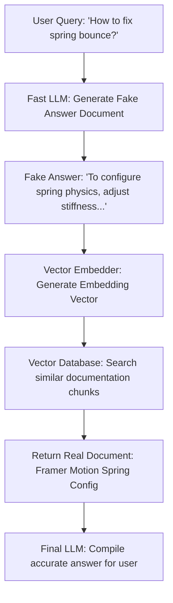

Did we build a multi-million-node vector search database only for our LLM to confidently make up fake statistics anyway? Yes.  
Did generating fake answers first solve it? Hell yes.

We’ve all been there: you connect your LLM to a vector database containing your documentation, codebase, or wiki pages (the classic **Retrieval-Augmented Generation / RAG** pattern). You ask it a question, and instead of pulling the right document, it returns a random unrelated chunk and proceeds to gaslight you with absolute confidence. 

Here is how I used **HyDE (Hypothetical Document Embeddings)** to force my vector search to actually find what my LLM needs.

---

## 😩 The Friction (Why Standard RAG Fails)

Standard RAG relies on a simple assumption: *“The user's query looks semantically similar to the answer in the database.”* 

This assumption is flat-out wrong:
* **Asymmetrical Vocabulary**: A user writes a short, confused query like *“stiffness dampening spring bounce NextJS”*. The database contains structured documentation blocks like *“Framer Motion physics config provides an interface to override mass values...”*. These two blocks of text do not look similar in vector space.
* **Semantic Drift**: Raw queries are questions (interrogative). Database chunks are answers (declarative). In vector space, questions tend to group with other questions, and answers group with other answers—meaning your search frequently misses the target.
* **Low Signal-to-Noise**: Messy keywords lead to irrelevant chunks being injected into the LLM context, which causes the model to hallucinate.

---

## ⚡ The Technical Blueprint (The HyDE Pipeline)

Instead of searching the vector database with the user’s raw query, we add a fast, cheap pre-processing step: **HyDE**. 

We ask a fast model to write a *hypothetical, fake answer* to the query first. We don't care if the facts in this fake answer are wrong; we just need its *format and vocabulary*. Then, we embed that fake answer and use **it** to search the database.



* **The Predictor**: A fast, low-temperature LLM call (e.g. Gemini 2.5 Flash) tasked with generating a hypothetical answer sheet.
* **The Vector Matcher**: Cosine similarity comparison running against the embedding of the *fake* document.
* **The Compiler**: The final model synthesizing real retrieved documents into a factual response.

---

## 💣 The Plot Twist (The Hallucination Cascade)

What if the first LLM generates a fake document that is so wildly incorrect it steers the vector search into a completely wrong neighborhood of your database? This is called a **Hallucination Cascade**.

If a user asks about a bug in *React spring config*, and the first LLM hallucinates a fake answer about *automotive metal spring suspensions*, your vector database will happily return mechanics documentation instead of JavaScript code!

#### The Fix
To prevent this, we enforce two rules:
1. **Low Temperature**: Set the generation temperature to `0.0` or `0.1` to force the LLM to output basic, non-creative structural templates.
2. **Contextual Fallback**: If the top cosine similarity score of the retrieved chunks falls below a threshold (e.g. `0.70`), we discard the hypothetical embedding and fall back to the user’s original query embedding.

```typescript
// 1. Generate hypothetical answer at low temperature
const fakeDoc = await gemini.generateText({
    prompt: `Write a technical documentation paragraph that answers: "${userQuery}"`,
    temperature: 0.1 // Prevent creative wandering
});

// 2. Embed the hypothetical document
const fakeEmbedding = await embedder.embed(fakeDoc);

// 3. Query vector database
let results = await vectorDb.query(fakeEmbedding, { limit: 3 });

// 4. Fallback if search confidence is low
if (results[0].score < 0.70) {
    const rawQueryEmbedding = await embedder.embed(userQuery);
    results = await vectorDb.query(rawQueryEmbedding, { limit: 3 });
}
```

---

## 💡 Pro-Tips & Mental Models

> [!TIP]
> **Pro-Tip on Embedding Alignments**: Answers look like answers. Embedding a hypothetical answer matches real answers in your database far better than embedding an interrogative question. 

> [!NOTE]
> **Fun Fact on Overhead**: While HyDE adds a few hundred milliseconds of latency for the initial LLM check, using a fast model (like Gemini Flash) keeps this under 200ms, which is a tiny price to pay for a 40% boost in retrieval accuracy.

---

## 🚀 Key Takeaways & Live Playground

* **Match Semantics, Not Keywords**: Questions and answers occupy different locations in vector space. Align them by converting queries into answers before embedding.
* **Guardrail Your Pipeline**: Set similarity thresholds to fallback to raw queries if your hypothetical document generator hallucinates wildly.
* **Optimize for Format**: You don't need accurate facts from the first LLM; you just need its vocabulary and syntax to query the vector database.

👉 **[Inspect the RAG & HyDE implementation details on GitHub](https://github.com/itishacodes/MindDump)**

---
