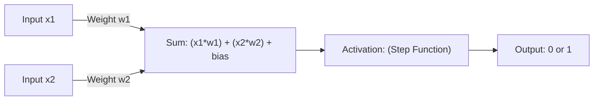

Does machine learning require layers of deep neural network weights? No.  
Can a single neuron learn the logical 'AND' gate using raw weight updates? Hell yes.

We talk about artificial intelligence in grandiose terms—multi-billion parameter models, tensor arrays, clusters of H100 GPUs, and black-box neural networks. It’s easy to feel like AI is an impenetrable wall of advanced calculus.

But if you zoom in on a massive LLM or image classifier, you’ll find that it is composed of billions of identical, microscopic building blocks: **artificial neurons**.

To understand how a machine "learns," we don’t need to train a massive cluster. We can write a single **Perceptron**—the ancestor of all modern deep learning—in about 30 lines of clean JavaScript, and watch it teach itself how to solve logical choices from scratch.

---

## Inside the Neuron: Inputs, Weights, and Bias

An artificial neuron is a mathematical function inspired by biological brain cells. It receives inputs, weighs their importance, adds a bias threshold, and fires an output signal:



1.  **Inputs ($x_1, x_2$)**: The raw data fed into the neuron.
2.  **Weights ($w_1, w_2$)**: Coefficients representing how important each input is. If $w_1$ is high, $x_1$ has a massive influence on the neuron firing.
3.  **Bias ($b$)**: A threshold factor that determines how easy it is for the neuron to fire, regardless of the inputs.
4.  **Activation Function**: A gatekeeper that squash-filters the sum of the inputs. In a basic Perceptron, we use a **Binary Step function**: if the total sum is greater than 0, output `1`; otherwise, output `0`.

Mathematically, it looks like this:

$$y = f\left(\sum_{i=1}^n x_i w_i + b\right)$$

---

## The Learning Loop: Adjusting the Weights

How does the neuron learn? We show it a dataset (like the logical `AND` gate matrix) and let it guess.

If the neuron guesses correctly, we leave the weights alone. If it guesses incorrectly, we calculate the error and adjust the weights in the direction of the correct target.

```typescript
// Tricky Part: The Perceptron learning correction loop
class Perceptron {
  constructor(inputCount, learningRate = 0.1) {
    this.weights = Array.from({ length: inputCount }, () => Math.random() * 2 - 1);
    this.bias = Math.random() * 2 - 1;
    this.lr = learningRate;
  }

  // 1. Feedforward: Compute the dot product and apply the Binary Step activation
  predict(inputs) {
    const sum = inputs.reduce((acc, x, i) => acc + x * this.weights[i], this.bias);
    return sum > 0 ? 1 : 0; // Binary Step Activation
  }

  // 2. Backpropagation: Adjust weights and bias based on prediction error
  train(inputs, target) {
    const prediction = this.predict(inputs);
    const error = target - prediction;

    if (error !== 0) {
      for (let i = 0; i < this.weights.length; i++) {
        // Adjust weight in the direction of the correct output target
        this.weights[i] += this.lr * error * inputs[i];
      }
      this.bias += this.lr * error;
    }
  }
}
```

> [!TIP]
> **Understanding Learning Rate ($lr$)**: If the learning rate is too high (e.g., `1.0`), the weights will oscillate wildly, overshooting the correct boundary. If it is too low (e.g., `0.0001`), the neuron will take thousands of iterations to learn. A value between `0.01` and `0.1` is the sweet spot for rapid convergence.

---

## The Line of Separation: Linear Classifiers

A single perceptron is a **linear classifier**. It represents a straight line cutting through coordinate space. Points on one side of the line are classified as `0`, and points on the other side are classified as `1`.

This is why a single perceptron can easily learn logic gates like `AND`, `OR`, and `NAND` (which are linearly separable), but fails completely on `XOR` (which requires a curved boundary). To solve `XOR`, you have to stack these neurons into layers, which is where **Multi-Layer Perceptrons (MLPs)** and modern deep learning begin!

---

## Activation Functions: Choosing Your Neural Gate

In a simple perceptron, we use a binary step. But modern networks swap this out depending on the layer's role:

| Activation Function | Math Formula | Output Range | Primary Use Case |
| :--- | :--- | :--- | :--- |
| **Binary Step** | $f(x) = x > 0 ? 1 : 0$ | $[0, 1]$ | Perceptrons / Simple classification |
| **Sigmoid** | $f(x) = \frac{1}{1 + e^{-x}}$ | $[0, 1]$ | Probability matching |
| **ReLU (Rectified Linear)** | $f(x) = \max(0, x)$ | $[0, \infty]$ | Hidden layers in deep networks |
| **Tanh** | $f(x) = \tanh(x)$ | $[-1, 1]$ | Recurrent networks |

👉 **[Inspect the Perceptron learning sandbox on GitHub](https://github.com/itishacodes/MindDump)**

---
