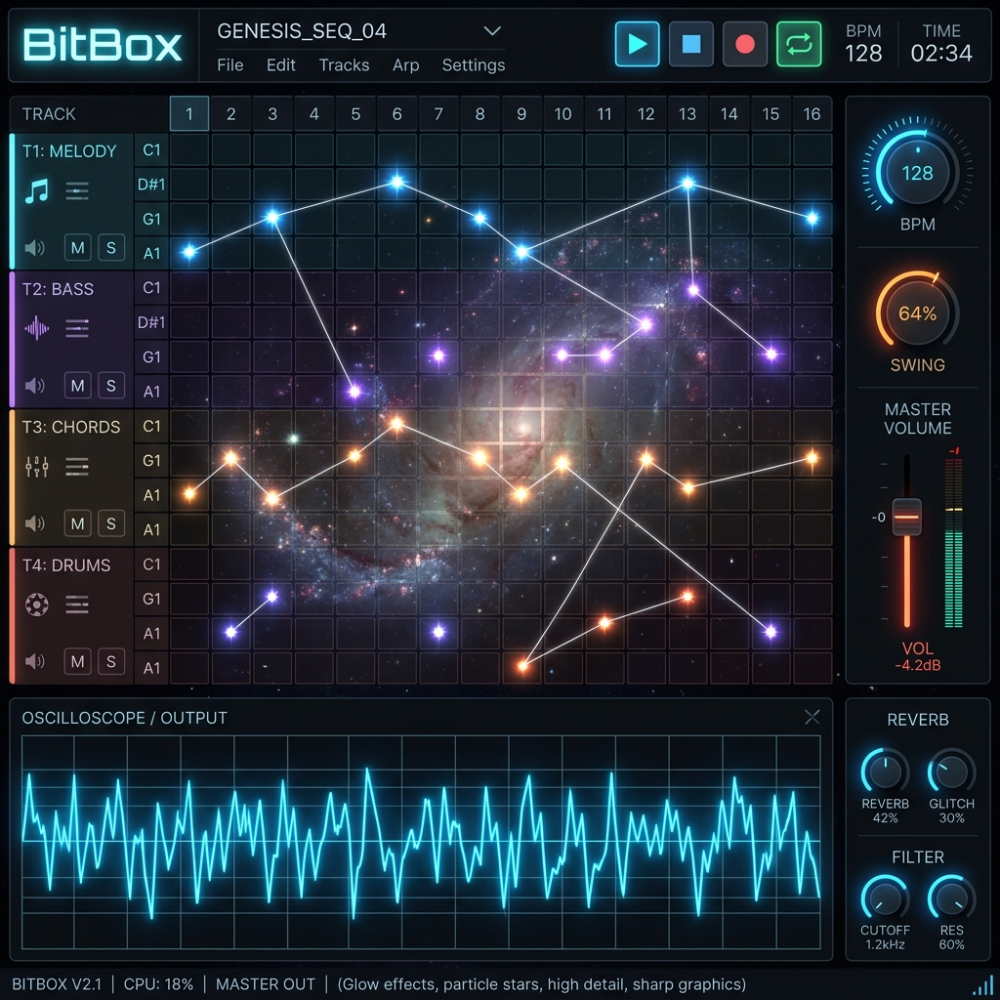
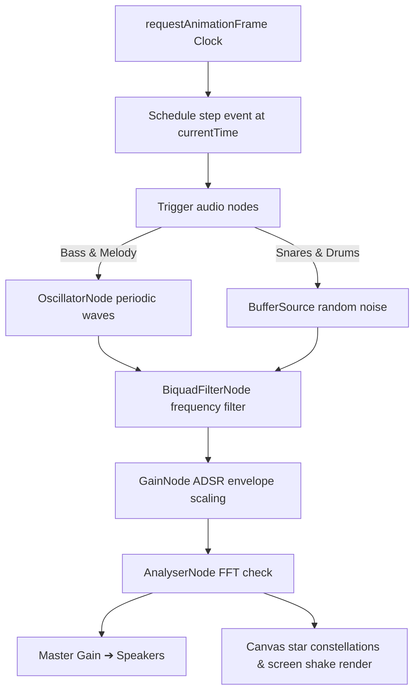

Was it built using heavy music frameworks? No, vanilla browser APIs.  
Did it squeeze a whole synth matrix into a single URL hash? Hell yes.

> *I vibe-coded this project at 2 AM because standard Spotify lo-fi study playlists weren't hitting right anymore. I decided I needed to synthesize my own retro 8-bit chiptune beats directly from browser audio oscillators while debugging code.*

**BitBox** is a zero-dependency audio-visual galaxy sequencer engineered entirely inside a single HTML5 canvas, generating retro chiptune sounds in real-time.



---

## 😩 The Friction (Heavy Audio Tooling Overhead)

Browser music platforms are often bloated:
* **Framework Weight**: Most music apps drag in heavy libraries (like Tone.js) just to schedule a basic chiptune beat.
* **Audio-Visual Desync**: Aligning screen animations with fast-speed audio beats using standard JS timers leads to noticeable timing drift.
* **Server Storage Overhead**: Saving composition matrices typically requires databases, servers, and storage buckets.

I wanted a zero-dependency sequencer that synthesizes sounds in real-time and encodes loops straight into URLs.

---

## ⚡ The Technical Blueprint (The Synth Matrix)

The entire sequencer clock and audio graph execute directly in the browser using the Web Audio API:



* **Core Node Routing**: Oscillators and buffer sources routed through biquad filters and gain nodes.
* **The Timer**: Audio scheduling synced to `audioContext.currentTime` for sub-millisecond precision.
* **Visual Parallax**: HTML5 Canvas rendering star field drift and constellation vectors matched to active note indices.

---

## 💣 The Plot Twist (The Sound Synthesis Challenge)

To keep the application size tiny, I avoided loading audio sample files. Every kick, snare, hi-hat, and pluck is synthesized from scratch using raw wave coordinates.

For a retro 8-bit pluck, standard square waves sound too sharp. I mapped custom harmonic weights using Web Audio's `createPeriodicWave` API, and routed the oscillator through a low-pass filter to smooth the decay envelope:

```javascript
// Custom retro pulse wave harmonics
const real = new Float32Array([0, 1, 0, 0.3, 0, 0.2, 0, 0.1]);
const imag = new Float32Array(real.length);
const wave = audioCtx.createPeriodicWave(real, imag);

// Mount wave onto oscillator and decay volume exponentially
osc.setPeriodicWave(wave);
gain.gain.setValueAtTime(0.3, triggerTime);
gain.gain.exponentialRampToValueAtTime(0.01, triggerTime + duration);
```

<style>
  :root {
    --bb-primary: #059669;
    --bb-primary-glow: rgba(5, 150, 105, 0.15);
    --bb-kick: #059669;
    --bb-snare: #dc2626;
    --bb-hat: #2563eb;
    --bb-pluck: #d97706;
  }
  :root[saved-theme="dark"] {
    --bb-primary: #33ff88;
    --bb-primary-glow: rgba(51, 255, 136, 0.3);
    --bb-kick: #33ff88;
    --bb-snare: #ff4466;
    --bb-hat: #44aaff;
    --bb-pluck: #ffaa33;
  }
</style>

<div class="soundboard-container" style="background: var(--light); border: 1px solid var(--lightgray); border-radius: 12px; padding: 20px; margin: 24px 0; font-family: var(--font-mono, monospace); color: var(--dark); box-shadow: 0 4px 15px rgba(0,0,0,0.08); transition: background 0.3s ease, border-color 0.3s ease, color 0.3s ease;">
  <h4 style="margin: 0 0 12px 0; color: var(--bb-primary); text-shadow: 0 0 10px var(--bb-primary-glow); font-size: 14px; text-transform: uppercase; letter-spacing: 2px; border: none; padding: 0; transition: color 0.3s ease;">⚡ BitBox Inline Soundboard</h4>
  <p style="font-size: 12px; color: var(--text-dim); margin-bottom: 16px; border: none; padding: 0;">Click the buttons below to trigger the real-time Web Audio synths described in this post. <span style="opacity: 0.7; font-size: 10px; display: block; margin-top: 4px;">🎧 Use earphones/headphones for best bass response.</span></p>
  <canvas id="soundboard-scope" width="400" height="80" style="width: 100%; height: 80px; background: var(--bg); border: 1px solid var(--lightgray); border-radius: 6px; display: block; margin-bottom: 16px; transition: background 0.3s ease, border-color 0.3s ease;"></canvas>
  <div style="display: flex; gap: 8px; flex-wrap: wrap; justify-content: center;">
    <button class="sb-btn" onclick="playSBInstrument('kick')" style="padding: 8px 16px; background: rgba(5,150,105,0.08); border: 1px solid var(--bb-kick); color: var(--bb-kick); border-radius: 6px; font-size: 11px; text-transform: uppercase; letter-spacing: 1px; cursor: pointer; transition: all 0.15s; font-family: monospace;">Kick</button>
    <button class="sb-btn" onclick="playSBInstrument('snare')" style="padding: 8px 16px; background: rgba(220,38,38,0.08); border: 1px solid var(--bb-snare); color: var(--bb-snare); border-radius: 6px; font-size: 11px; text-transform: uppercase; letter-spacing: 1px; cursor: pointer; transition: all 0.15s; font-family: monospace;">Snare</button>
    <button class="sb-btn" onclick="playSBInstrument('hat')" style="padding: 8px 16px; background: rgba(37,99,235,0.08); border: 1px solid var(--bb-hat); color: var(--bb-hat); border-radius: 6px; font-size: 11px; text-transform: uppercase; letter-spacing: 1px; cursor: pointer; transition: all 0.15s; font-family: monospace;">Hi-Hat</button>
    <button class="sb-btn" onclick="playSBInstrument('pluck')" style="padding: 8px 16px; background: rgba(217,119,6,0.08); border: 1px solid var(--bb-pluck); color: var(--bb-pluck); border-radius: 6px; font-size: 11px; text-transform: uppercase; letter-spacing: 1px; cursor: pointer; transition: all 0.15s; font-family: monospace;">Pluck</button>
  </div>
</div>

<script>
  let sbAudioCtx = null;
  let sbAnalyser = null;
  let sbMasterGain = null;
  let sbNoiseBuffer = null;
  
  function initSBAudio() {
    if (sbAudioCtx) return;
    const AudioContext = window.AudioContext || window.webkitAudioContext;
    sbAudioCtx = new AudioContext();
    sbAnalyser = sbAudioCtx.createAnalyser();
    sbAnalyser.fftSize = 256;
    sbMasterGain = sbAudioCtx.createGain();
    sbMasterGain.gain.value = 0.3;
    sbMasterGain.connect(sbAnalyser);
    sbAnalyser.connect(sbAudioCtx.destination);
    
    const bufferSize = sbAudioCtx.sampleRate * 1;
    sbNoiseBuffer = sbAudioCtx.createBuffer(1, bufferSize, sbAudioCtx.sampleRate);
    const data = sbNoiseBuffer.getChannelData(0);
    for (let i = 0; i < bufferSize; i++) {
      data[i] = Math.random() * 2 - 1;
    }
    
    drawSBScope();
  }
  
  function drawSBScope() {
    const canvas = document.getElementById('soundboard-scope');
    if (!canvas) return;
    const ctx = canvas.getContext('2d');
    const width = canvas.width;
    const height = canvas.height;
    const bufferLength = sbAnalyser.frequencyBinCount;
    const dataArray = new Uint8Array(bufferLength);
    
    function draw() {
      requestAnimationFrame(draw);
      sbAnalyser.getByteTimeDomainData(dataArray);
      const isDark = document.documentElement.getAttribute('saved-theme') === 'dark';
      
      ctx.fillStyle = isDark ? '#05080c' : '#f5f6f8';
      ctx.fillRect(0, 0, width, height);
      ctx.lineWidth = 2;
      ctx.strokeStyle = isDark ? '#33ff88' : '#059669';
      ctx.beginPath();
      const sliceWidth = width / bufferLength;
      let x = 0;
      for (let i = 0; i < bufferLength; i++) {
        const v = dataArray[i] / 128.0;
        const y = (v * height) / 2;
        if (i === 0) ctx.moveTo(x, y);
        else ctx.lineTo(x, y);
        x += sliceWidth;
      }
      ctx.lineTo(width, height / 2);
      ctx.stroke();
    }
    draw();
  }
  
  function playSBInstrument(inst) {
    initSBAudio();
    if (sbAudioCtx.state === 'suspended') sbAudioCtx.resume();
    const time = sbAudioCtx.currentTime;
    
    if (inst === 'kick') {
      const osc = sbAudioCtx.createOscillator();
      const gain = sbAudioCtx.createGain();
      osc.frequency.setValueAtTime(150, time);
      osc.frequency.exponentialRampToValueAtTime(40, time + 0.15);
      gain.gain.setValueAtTime(0.8, time);
      gain.gain.exponentialRampToValueAtTime(0.01, time + 0.2);
      osc.connect(gain); gain.connect(sbMasterGain);
      osc.start(time); osc.stop(time + 0.2);
    } 
    else if (inst === 'snare') {
      const source = sbAudioCtx.createBufferSource();
      const gain = sbAudioCtx.createGain();
      const filter = sbAudioCtx.createBiquadFilter();
      source.buffer = sbNoiseBuffer;
      filter.type = 'highpass'; filter.frequency.value = 800;
      gain.gain.setValueAtTime(0.4, time);
      gain.gain.exponentialRampToValueAtTime(0.01, time + 0.25);
      source.connect(filter); filter.connect(gain); gain.connect(sbMasterGain);
      source.start(time); source.stop(time + 0.25);
    } 
    else if (inst === 'hat') {
      const source = sbAudioCtx.createBufferSource();
      const gain = sbAudioCtx.createGain();
      const filter = sbAudioCtx.createBiquadFilter();
      source.buffer = sbNoiseBuffer;
      filter.type = 'highpass'; filter.frequency.value = 7000;
      gain.gain.setValueAtTime(0.2, time);
      gain.gain.exponentialRampToValueAtTime(0.01, time + 0.05);
      source.connect(filter); filter.connect(gain); gain.connect(sbMasterGain);
      source.start(time); source.stop(time + 0.05);
    } 
    else if (inst === 'pluck') {
      const osc = sbAudioCtx.createOscillator();
      const gain = sbAudioCtx.createGain();
      const filter = sbAudioCtx.createBiquadFilter();
      const real = new Float32Array([0, 1, 0, 0.3, 0, 0.2, 0, 0.1]);
      const imag = new Float32Array(real.length);
      const wave = sbAudioCtx.createPeriodicWave(real, imag);
      osc.setPeriodicWave(wave);
      osc.frequency.setValueAtTime(440, time);
      filter.type = 'lowpass'; filter.frequency.value = 3000;
      gain.gain.setValueAtTime(0.5, time);
      gain.gain.exponentialRampToValueAtTime(0.01, time + 0.2);
      osc.connect(filter); filter.connect(gain); gain.connect(sbMasterGain);
      osc.start(time); osc.stop(time + 0.2);
    }
  }
</script>

---

## 💡 Pro-Tips & Mental Models

> [!TIP]
> **Pro-Tip on Synth Timing**: Never use standard JavaScript `setInterval` or `setTimeout` loops for audio scheduling! They drift due to main-thread tasks. Always schedule envelope values against `AudioContext.currentTime`.

> [!NOTE]
> **Fun Fact on White Noise**: You can generate white noise in the browser by filling a standard audio buffer with random numbers: `Math.random() * 2 - 1`. Route this through high-pass filters to synthesize hi-hat clicks and snare drum cracks.

---

## 🚀 Key Takeaways & Live Playground

* **Direct Web DSP**: Real-time sound synthesis in browsers is highly efficient and skips large sample file load times.
* **Audio Clocks**: The Web Audio clock provides rock-solid timings, completely decoupling from JS main-thread lag.
* **Share via URL Hash**: Compressing note sequences via LZString lets compositions sit right inside URL hashes, keeping backend database bills at $0.

👉 **[Launch the BitBox Composer Live](https://itishacodes.github.io/BitBox/)**

---
