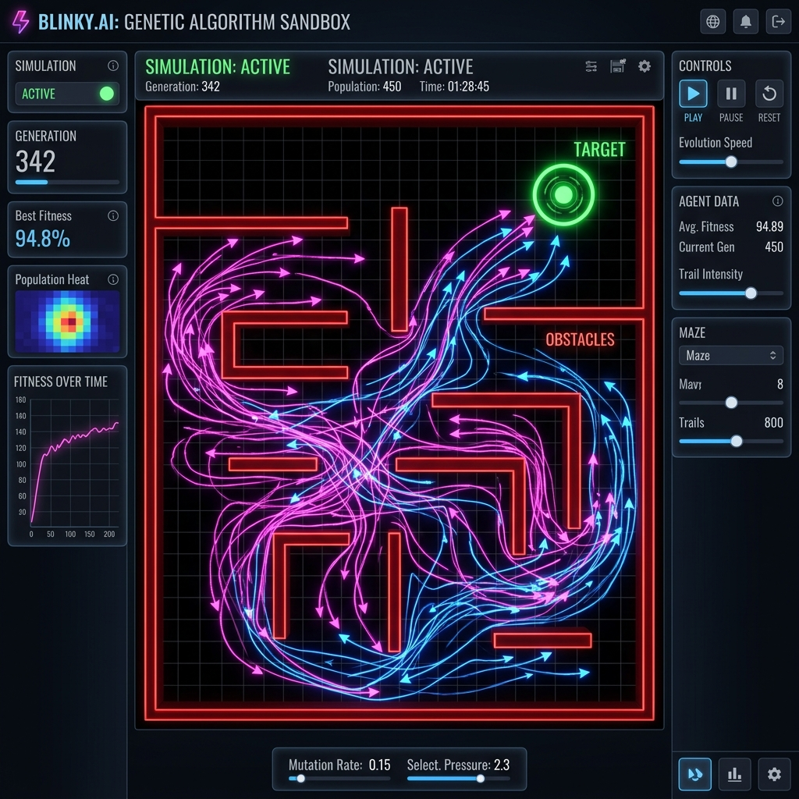
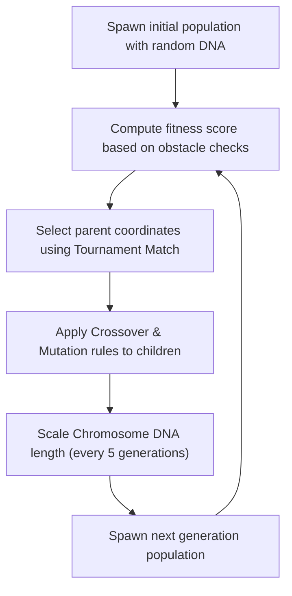

Was it deep learning? No, just simple Darwinian selection.  
Did it solve the maze in under 15 generations? Hell yes.

ML tutorials point you straight to heavy Python frameworks. But pulling in gigabytes of code just to watch a dots coordinate paths is a complete vibe-kill. **Blinky.ai** is a zero-dependency genetic algorithm sandbox written in vanilla TypeScript, powered by vector math and canvas drawing.



---

## 😩 The Friction (ML Framework Bloat)

Basic machine learning models shouldn't require complex environments:
* **The Dependency Tax**: Standard setups drag in heavy runtime engines (TensorFlow, PyTorch) for simple spatial optimizations.
* **The Convergence Lag**: Starting agents with long DNA sequences creates vast search matrices, taking hundreds of generations to coordinate.
* **Complex Model Exports**: Saving learned routes typically relies on heavy binary model serializers.

I wanted an instant, lightweight TypeScript simulation running pathfinding sweeps on pure vector arithmetic.

---

## ⚡ The Technical Blueprint (The Swarm Engine)

The agent loop executes completely client-side in the browser main thread:



* **The Core**: Vanilla TypeScript performing vector additions on agent paths.
* **The Render Loop**: `requestAnimationFrame` pushing arrow coordinate matrices onto a canvas grid at 60 FPS.
* **The DNA Stack**: Array sequence of 2D velocity directions mapped to each particle.

---

## 💣 The Plot Twist (The Infinite Search Space Crisis)

If you start agents with their full lifespan DNA (e.g. 200 moves), their initial paths are way too chaotic. The search space is too wide, and the algorithm takes hundreds of generations to discover the path around obstacle walls.

#### The Fix
I built an **incremental chromosome growth pipeline**:
1. **The Starting DNA**: The swarm begins with a lifespan of only 30 steps (`INITIAL_CHROMOSOME_LENGTH = 30`).
2. **The Growth Loop**: Every 5 generations, the chromosome length automatically grows by 10 steps (`GROWTH_STEP = 10`) until it caps at 200.
3. **The Benefit**: Starting with a short DNA helps the swarm learn the first few turns fast. Once they get basic navigation down, growing the action space lets them solve the rest of the maze.

```typescript
function crossover(genesA: Vec2[], genesB: Vec2[], targetLength: number): Vec2[] {
  // Select a random slice coordinate
  const cut = (Math.random() * Math.min(genesA.length, genesB.length)) | 0;
  
  // Concatenate Parent A and Parent B genes
  const child = genesA.slice(0, cut).concat(genesB.slice(cut));
  
  // Pad if the child is shorter than the target length
  while (child.length < targetLength) child.push(randDir());
  
  return child.slice(0, targetLength);
}
```

<style>
  :root {
    --bl-primary: #db2777;
    --bl-primary-glow: rgba(219, 39, 119, 0.2);
  }
  :root[saved-theme="dark"] {
    --bl-primary: #ff3388;
    --bl-primary-glow: rgba(255, 51, 136, 0.3);
  }
</style>

<div class="blinky-sandbox-container" onmouseenter="ensureBlinkyInit(this)" ontouchstart="ensureBlinkyInit(this)" style="background: var(--light); border: 1px solid var(--lightgray); border-radius: 12px; padding: 20px; margin: 24px auto; font-family: var(--font-mono, monospace); color: var(--dark); max-width: 380px; box-shadow: 0 4px 15px rgba(0,0,0,0.08); transition: background 0.3s ease, border-color 0.3s ease, color 0.3s ease;">
  <h4 style="margin: 0 0 12px 0; color: var(--bl-primary); text-shadow: 0 0 10px var(--bl-primary-glow); font-size: 14px; text-transform: uppercase; letter-spacing: 2px; border: none; padding: 0; transition: color 0.3s ease;">⚡ Genetic Swarm Simulator</h4>
  <p style="font-size: 11px; color: var(--text-dim); margin-bottom: 12px; border: none; padding: 0;">Watch the swarm of dots adapt over generations to navigate to the green target using crossover and mutations.</p>
  
  <div style="display: flex; justify-content: space-between; font-size: 10px; margin-bottom: 10px; color: var(--bl-primary); transition: color 0.3s ease;">
    <span id="blinky-gen">Gen: 0</span>
    <span id="blinky-fit">Best Distance: --</span>
  </div>
  
  <canvas id="blinky-canvas" width="340" height="150" style="width: 100%; height: 150px; background: var(--bg); border: 1px solid var(--lightgray); border-radius: 6px; display: block; transition: background 0.3s ease, border-color 0.3s ease;"></canvas>
</div>

<script>
  let blCanvas = null;
  let blCtx = null;
  let blAnimId = null;
  
  const blPopSize = 12;
  const blLifespan = 80;
  const blMutationRate = 0.05;
  
  let blGen = 0;
  let blStep = 0;
  let blPopulation = [];
  let blTarget = { x: 300, y: 75 };
  let blStart = { x: 30, y: 75 };
  
  function getBlCanvas() {
    return document.getElementById('blinky-canvas');
  }
  
  function ensureBlinkyInit(el) {
    if (el.dataset.init) return;
    el.dataset.init = "true";
    initBlinky();
  }
  
  function initBlinky() {
    blCanvas = getBlCanvas();
    if (!blCanvas) return;
    blCtx = blCanvas.getContext('2d');
    
    blPopulation = [];
    for (let i = 0; i < blPopSize; i++) {
      blPopulation.push(createAgent());
    }
    
    blGen = 1;
    blStep = 0;
    
    if (blAnimId) cancelAnimationFrame(blAnimId);
    animateBlinky();
    
    const blObserver = new MutationObserver(() => {
      if (blCtx) drawBlinky();
    });
    blObserver.observe(document.documentElement, { attributes: true, attributeFilter: ['saved-theme'] });
  }
  
  function createAgent(genes = null) {
    if (!genes) {
      genes = [];
      for (let i = 0; i < blLifespan; i++) {
        const angle = Math.random() * Math.PI * 2;
        genes.push({ x: Math.cos(angle) * 3, y: Math.sin(angle) * 3 });
      }
    }
    return {
      x: blStart.x,
      y: blStart.y,
      dead: false,
      completed: false,
      genes: genes,
      fitness: 0
    };
  }
  
  function animateBlinky() {
    blAnimId = requestAnimationFrame(animateBlinky);
    updateBlinky();
    drawBlinky();
  }
  
  function updateBlinky() {
    let allFinished = true;
    
    for (let i = 0; i < blPopSize; i++) {
      const agent = blPopulation[i];
      if (agent.dead || agent.completed) continue;
      
      allFinished = false;
      
      const force = agent.genes[blStep];
      agent.x += force.x;
      agent.y += force.y;
      
      if (agent.x < 0 || agent.x > blCanvas.width || agent.y < 0 || agent.y > blCanvas.height) {
        agent.dead = true;
      }
      
      const dist = Math.hypot(agent.x - blTarget.x, agent.y - blTarget.y);
      if (dist < 10) {
        agent.completed = true;
        agent.x = blTarget.x;
        agent.y = blTarget.y;
      }
    }
    
    blStep++;
    
    if (blStep >= blLifespan || allFinished) {
      evaluateAndReproduce();
    }
  }
  
  function evaluateAndReproduce() {
    let bestDist = Infinity;
    for (let i = 0; i < blPopSize; i++) {
      const agent = blPopulation[i];
      const dist = Math.hypot(agent.x - blTarget.x, agent.y - blTarget.y);
      if (dist < bestDist) bestDist = dist;
      
      let score = 1 / (dist + 1);
      if (agent.completed) score *= 5;
      if (agent.dead) score *= 0.1;
      agent.fitness = score;
    }
    
    const genEl = document.getElementById('blinky-gen');
    const fitEl = document.getElementById('blinky-fit');
    if (genEl) genEl.textContent = `Gen: ${blGen}`;
    if (fitEl) fitEl.textContent = `Best Distance: ${Math.round(bestDist)}px`;
    
    const pool = [];
    for (let i = 0; i < blPopSize; i++) {
      const n = Math.floor(blPopulation[i].fitness * 100);
      for (let j = 0; j < n; j++) pool.push(blPopulation[i]);
    }
    
    const nextGeneration = [];
    for (let i = 0; i < blPopSize; i++) {
      const parentA = pool.length > 0 ? pool[Math.floor(Math.random() * pool.length)] : blPopulation[Math.floor(Math.random() * blPopSize)];
      const parentB = pool.length > 0 ? pool[Math.floor(Math.random() * pool.length)] : blPopulation[Math.floor(Math.random() * blPopSize)];
      
      const childGenes = crossoverGenes(parentA.genes, parentB.genes);
      mutateGenes(childGenes);
      nextGeneration.push(createAgent(childGenes));
    }
    
    blPopulation = nextGeneration;
    blGen++;
    blStep = 0;
  }
  
  function crossoverGenes(genesA, genesB) {
    const cut = Math.floor(Math.random() * blLifespan);
    const child = genesA.slice(0, cut).concat(genesB.slice(cut));
    return child;
  }
  
  function mutateGenes(genes) {
    for (let i = 0; i < blLifespan; i++) {
      if (Math.random() < blMutationRate) {
        const angle = Math.random() * Math.PI * 2;
        genes[i] = { x: Math.cos(angle) * 3, y: Math.sin(angle) * 3 };
      }
    }
  }
  
  function drawBlinky() {
    if (!blCtx) return;
    const isDark = document.documentElement.getAttribute('saved-theme') === 'dark';
    
    blCtx.fillStyle = isDark ? '#05080c' : '#f5f6f8';
    blCtx.fillRect(0, 0, blCanvas.width, blCanvas.height);
    
    blCtx.beginPath();
    blCtx.arc(blTarget.x, blTarget.y, 8, 0, Math.PI * 2);
    blCtx.fillStyle = isDark ? '#33ff88' : '#059669';
    blCtx.shadowBlur = 10;
    blCtx.shadowColor = isDark ? '#33ff88' : '#059669';
    blCtx.fill();
    blCtx.shadowBlur = 0;
    
    for (let i = 0; i < blPopSize; i++) {
      const agent = blPopulation[i];
      blCtx.beginPath();
      blCtx.arc(agent.x, agent.y, 3, 0, Math.PI * 2);
      if (agent.completed) {
        blCtx.fillStyle = isDark ? '#ffaa33' : '#d97706';
      } else if (agent.dead) {
        blCtx.fillStyle = isDark ? '#ff4466' : '#dc2626';
      } else {
        blCtx.fillStyle = isDark ? '#ff3388' : '#db2777';
      }
      blCtx.fill();
    }
  }
</script>

---

## 💡 Pro-Tips & Mental Models

> [!TIP]
> **Pro-Tip on Selection Optimization**: Tournament Selection (matching random pairs) is computationally lighter than sorting an entire agent array by fitness score on every loop.

> [!NOTE]
> **Fun Fact on Mutations**: A low mutation rate (e.g. 2-5%) is essential. Too high, and the swarm collapses into random chaotic noise; too low, and agents get stuck in local dead-ends.

---

## 🚀 Key Takeaways & Live Playground

* **Expand DNA Gradually**: Start agent movement genomes short and expand them over generations to optimize search paths.
* **Vector Math Rules**: Basic trigonometry vectors are enough to model complex spatial navigation without neural weight compilers.
* **JSON Serialization**: Storing parent DNA matrices as simple array text makes model sharing trivial.

👉 **[Try the Swarm Sandbox Live](https://itishacodes.github.io/Blinky.ai/)**

---
