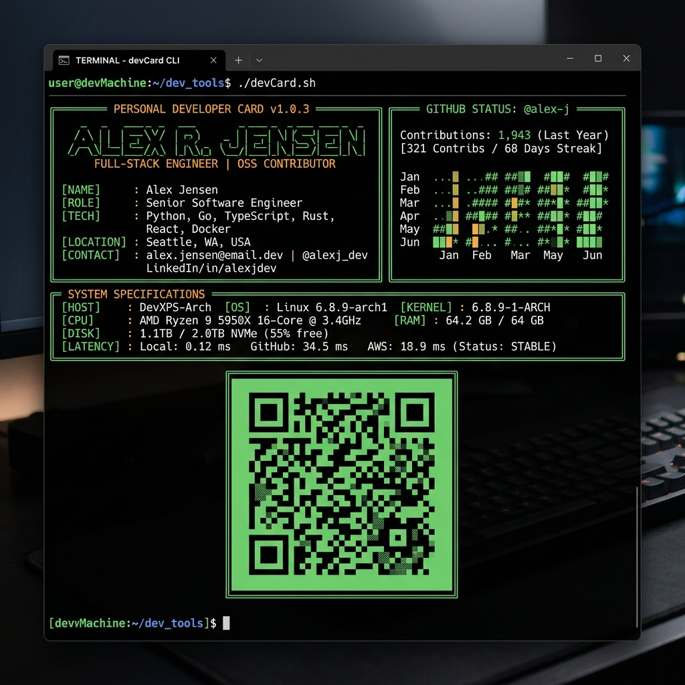
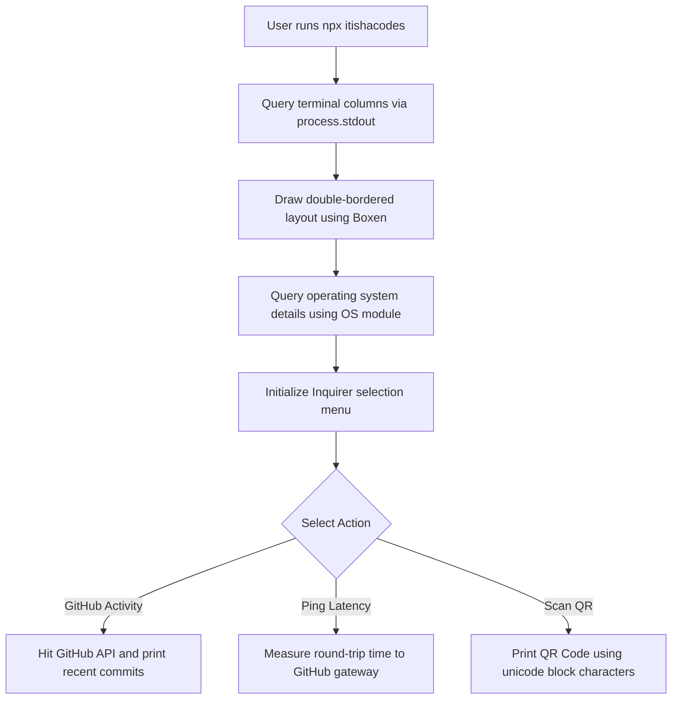

Was it simple? Yes.  
Did it make my resume run inside a terminal split-pane? Hell yes.

Traditional PDF resumes and static landing pages are cool, but they aren't interactive. **DevCard** is a fully interactive CLI card that packs my bio, core tech stack, live GitHub commit stats, and server latency pings directly into a user's terminal window.

```bash
npx itishacodes
```



---

## 😩 The Friction (Static Resumes Suck)

Developer portfolios are too generic:
* **The PDF Graveyard**: Recruiters download dozens of PDF resumes that all look identical.
* **Friction to Run**: Cloning a repo just to read a developer's contact details is a vibe-kill.
* **Static Content**: Portfolio websites get outdated fast unless linked to active code activity.

I wanted an instant terminal card that executes with a single command and streams live metrics on-demand.

---

## ⚡ The Technical Blueprint (The CLI Engine)

Building for the terminal is a completely different beast than building for the web. We map operations to a raw matrix grid:



* **The Core**: Node.js compiled down to ES Modules using TypeScript.
* **Layout Grid**: **Boxen** for drawing clean panel borders, and **Chalk** for ANSI console colors.
* **Interactivity**: **@inquirer/search** for arrow-key navigations and live autocomplete lists.

---

## 💣 The Plot Twist (The Terminal Resizing Crisis)

Terminal windows have no media queries. If a user runs your CLI card inside a split-pane or a tiny screen, large ASCII banner graphics wrap onto new lines, corrupting the layout completely.

#### The Fix
Instead of hardcoding layout text blocks, I built a responsive column width check. The script queries `process.stdout.columns` before printing, falling back to a clean inline text signature if horizontal spacing is tight:

```typescript
const getResponsiveName = () => {
    const cols = process.stdout.columns || 80;
    
    // Fall back to clean inline text if workspace space is tight
    if (cols < 65) {
        return chalk.bold.green("              ITISHA");
    }
    
    // Output full large ASCII artwork if screen space allows
    return chalk.bold.green(`  ███████╗ ████████╗ ██╗ ███████╗...`);
};
```

---

## 💡 Pro-Tips & Mental Models

> [!TIP]
> **Pro-Tip on CLI Latency**: Nobody wants to wait for a CLI card to start up. Keep dependencies to the bare minimum and bundle your JS output. Instant execution is key to terminal UX.

> [!NOTE]
> **Fun Fact on Terminal Graphics**: You can render fully scannable QR codes in raw terminal output using Unicode block characters (`▄`, `▀`, `█`) to represent the black and white pixel matrices.

---

## 🚀 Key Takeaways & Live Playground

* **Grids over Flow**: Terminals are rigid character matrices. Keep coordinate lengths checked to prevent wrapping bugs.
* **Dynamic over Static**: Fetching live commit stats and server latency pings keeps terminal content fresh.
* **NPX Deployment**: Mapping the `"bin"` mapping in `package.json` makes distributing CLI tools seamless.

👉 **Run it now in your terminal:**
```bash
npx itishacodes
```

---
