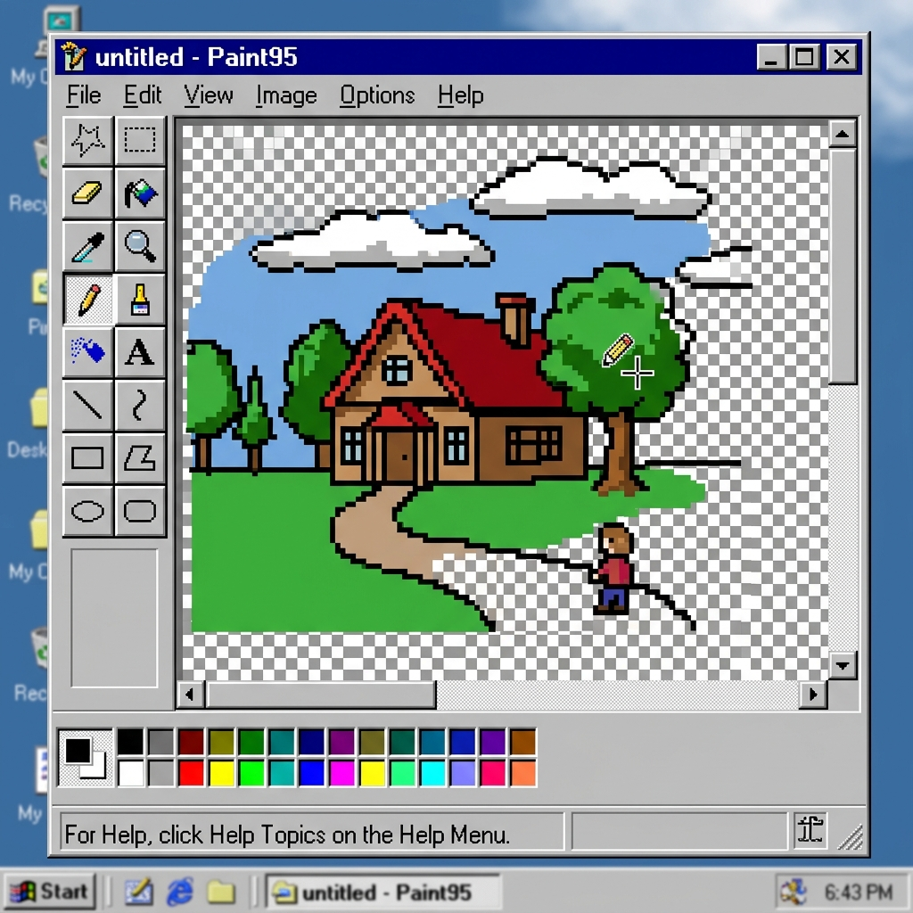
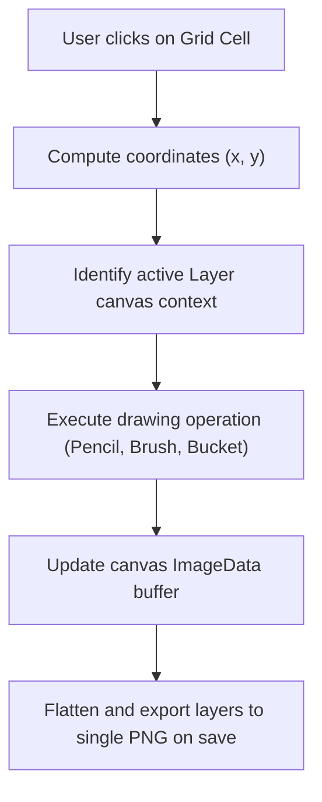

Was it retro? Yes.  
Did it perform flood fills on anti-aliased margins in under 5ms? Hell yes.

> *I vibe-coded this project because modern flat minimalist web design was starting to look sterile and boring. I missed the chunky grey beveled plastic buttons, the retro palettes, and the pure dopamine of clicking the bucket fill tool in classic Windows 95 MS Paint.*

**Paint95** is a pixel-art drawing studio styled exactly like Windows 95 MS Paint, written entirely in vanilla HTML, CSS, and JS with zero external dependencies.



---

## 😩 The Friction (Flat Minimalist Exhaustion)

Modern painting apps are overly complex:
* **Feature Bloat**: Most drawing apps force you through massive tutorials just to draw a pixel.
* **Heavy Libraries**: Relying on large canvas wrappers (like Konva or Fabric) increases bundle sizes by hundreds of kilobytes.
* **Bevel Shading Overhead**: Recreating 16-bit 3D light-source borders typically relies on heavy image slices or SVG wrappers.

I wanted a lightweight, zero-dependency MS Paint engine running on vanilla web standards.

---

## ⚡ The Technical Blueprint (The Paint Engine)

Paint95 splits operations between a retro CSS-rendered window frame and an active canvas context stack:



* **The UI Structure**: Pure CSS grid and box-shadow border offsets simulating Windows 95 borders.
* **The Layer Stack**: Multiple overlapping absolute-positioned canvases for multi-layer draws.
* **Pixel Manipulation**: Custom pixel-level algorithms operating directly on canvas `ImageData` arrays.

---

## 💣 The Plot Twist (The Maximum Stack Overflow Crash)

If you implement a standard flood fill (the bucket tool) using simple recursive functions, the browser will crash with a `RangeError: Maximum call stack size exceeded` the second you try to fill a large area! The execution stack depth on an $800 \times 600$ canvas is way too high.

#### The Fix
I replaced recursion with an **iterative Depth-First Search (DFS) flood fill** powered by a flat array coordinate stack. To handle anti-aliased borders smoothly, I added a color tolerance check:

```javascript
// Iterative stack loop handles neighbors without recursion crashes
while (stack.length) {
  const y = stack.pop(), x = stack.pop();
  const flat = y * canvasWidth + x;
  const i = flat * 4;

  if (matches(i) && !visited[flat]) {
    visited[flat] = 1;
    imgData[i] = fillR; // Paint pixel
    stack.push(x + 1, y, x - 1, y, x, y + 1, x, y - 1);
  }
}
```

Pre-allocating the visitor array using a high-performance `Uint8Array(width * height)` keeps execution times under 5 milliseconds.

<style>
  :root {
    --w95-bg: #c0c0c0;
    --w95-fg: #000000;
    --w95-canvas-bg: #ffffff;
    --w95-grid: #e0e0e0;
    --w95-border-light: #ffffff;
    --w95-border-dark: #808080;
    --w95-titlebar: #000080;
    --w95-titlebar-text: #ffffff;
  }
  :root[saved-theme="dark"] {
    --w95-bg: #22252a;
    --w95-fg: #e2e8f0;
    --w95-canvas-bg: #111317;
    --w95-grid: #2c2f35;
    --w95-border-light: #3d424b;
    --w95-border-dark: #0f1013;
    --w95-titlebar: #1e293b;
    --w95-titlebar-text: #f1f5f9;
  }
  .paint95-sandbox-container {
    background: var(--w95-bg);
    border-top: 2px solid var(--w95-border-light);
    border-left: 2px solid var(--w95-border-light);
    border-right: 2px solid var(--w95-border-dark);
    border-bottom: 2px solid var(--w95-border-dark);
    padding: 16px;
    margin: 24px auto;
    font-family: monospace;
    color: var(--w95-fg);
    max-width: 320px;
    box-shadow: 2px 2px 10px rgba(0,0,0,0.3);
    transition: background 0.3s ease, border-color 0.3s ease, color 0.3s ease;
  }
  .win95-btn {
    background: var(--w95-bg);
    border-top: 1.5px solid var(--w95-border-light);
    border-left: 1.5px solid var(--w95-border-light);
    border-right: 1.5px solid var(--w95-border-dark);
    border-bottom: 1.5px solid var(--w95-border-dark);
    color: var(--w95-fg);
    transition: background 0.3s ease, border-color 0.3s ease, color 0.3s ease;
  }
  .win95-btn:active, .win95-btn.pressed {
    border-top: 1.5px solid var(--w95-border-dark);
    border-left: 1.5px solid var(--w95-border-dark);
    border-right: 1.5px solid var(--w95-border-light);
    border-bottom: 1.5px solid var(--w95-border-light);
  }
</style>

<div class="paint95-sandbox-container" onmouseenter="ensureSandboxInit(this)" ontouchstart="ensureSandboxInit(this)">
  <!-- Titlebar -->
  <div style="background: var(--w95-titlebar); color: var(--w95-titlebar-text); padding: 3px 6px; font-weight: bold; font-size: 11px; display: flex; justify-content: space-between; align-items: center; margin-bottom: 12px; transition: background 0.3s ease, color 0.3s ease;">
    <span>⚡ Paint95.exe - Sandbox</span>
    <span style="font-size: 9px; cursor: pointer; border: 1.5px solid var(--w95-border-light); padding: 0 4px; background: var(--w95-bg); color: var(--w95-fg); transition: background 0.3s ease, color 0.3s ease;">X</span>
  </div>
  
  <p style="font-size: 11px; margin: 0 0 12px 0; line-height: 1.3;">Draw retro pixel-art by clicking or dragging on the grid cells below.</p>
  
  <div style="display: flex; gap: 12px; align-items: center; justify-content: center; flex-wrap: wrap;">
    <canvas id="paint95-canvas" width="160" height="160"
      onmousedown="startPaint(event)"
      onmousemove="paintCell(event)"
      onmouseup="stopPaint()"
      ontouchstart="event.preventDefault(); startPaint(event.touches[0])"
      ontouchmove="event.preventDefault(); paintCell(event.touches[0])"
      ontouchend="stopPaint()"
      style="background: var(--w95-canvas-bg); border-top: 2px solid var(--w95-border-dark); border-left: 2px solid var(--w95-border-dark); border-right: 2px solid var(--w95-border-light); border-bottom: 2px solid var(--w95-border-light); cursor: crosshair; image-rendering: pixelated; display: block; transition: background 0.3s ease, border-color 0.3s ease;"></canvas>
    
    <div style="display: flex; flex-direction: column; gap: 8px;">
      <div style="display: grid; grid-template-columns: repeat(2, 24px); gap: 4px;">
        <button onclick="setSandboxColor('#000000')" style="width: 24px; height: 24px; background: #000000; border: 1.5px solid var(--w95-border-dark); cursor: pointer;"></button>
        <button onclick="setSandboxColor('#ff0000')" style="width: 24px; height: 24px; background: #ff0000; border: 1.5px solid var(--w95-border-dark); cursor: pointer;"></button>
        <button onclick="setSandboxColor('#00ff00')" style="width: 24px; height: 24px; background: #00ff00; border: 1.5px solid var(--w95-border-dark); cursor: pointer;"></button>
        <button onclick="setSandboxColor('#0000ff')" style="width: 24px; height: 24px; background: #0000ff; border: 1.5px solid var(--w95-border-dark); cursor: pointer;"></button>
      </div>
      <button class="win95-btn" onclick="clearSandboxPaint()" style="padding: 4px; font-size: 10px; cursor: pointer; font-family: monospace;">Clear</button>
    </div>
  </div>
</div>

<script>
  let pCanvas = null;
  let pCtx = null;
  let pColor = '#000000';
  let pDrawing = false;
  let pHasDrawn = false;
  const cellSize = 16;
  const gridCount = 10;
  
  function getW95Colors() {
    const isDark = document.documentElement.getAttribute('saved-theme') === 'dark';
    return {
      canvasBg: isDark ? '#111317' : '#ffffff',
      grid: isDark ? '#2c2f35' : '#e0e0e0',
      defaultColor: isDark ? '#ffffff' : '#000000'
    };
  }
  
  function getPCanvas() {
    return document.getElementById('paint95-canvas');
  }
  
  function ensureSandboxInit(el) {
    if (el.dataset.init) return;
    el.dataset.init = "true";
    pColor = getW95Colors().defaultColor;
    clearSandboxPaint();
    window.addEventListener('mouseup', stopPaint);
    
    const wObserver = new MutationObserver((mutations) => {
      mutations.forEach((mutation) => {
        if (mutation.type === 'attributes' && mutation.attributeName === 'saved-theme') {
          const colors = getW95Colors();
          if (!pHasDrawn) {
            pColor = colors.defaultColor;
            clearSandboxPaint();
          } else {
            const canvas = getPCanvas();
            if (canvas) {
              const ctx = canvas.getContext('2d');
              drawGrid(ctx, canvas);
            }
          }
        }
      });
    });
    wObserver.observe(document.documentElement, { attributes: true });
  }
  
  function startPaint(e) {
    pDrawing = true;
    pHasDrawn = true;
    paintCell(e);
  }
  
  function paintCell(e) {
    if (!pDrawing) return;
    const canvas = getPCanvas();
    if (!canvas) return;
    const ctx = canvas.getContext('2d');
    const rect = canvas.getBoundingClientRect();
    
    const clientX = e.clientX !== undefined ? e.clientX : e.pageX;
    const clientY = e.clientY !== undefined ? e.clientY : e.pageY;
    
    const x = ((clientX - rect.left) / rect.width) * canvas.width;
    const y = ((clientY - rect.top) / rect.height) * canvas.height;
    const cx = Math.floor(x / cellSize);
    const cy = Math.floor(y / cellSize);
    
    if (cx >= 0 && cx < gridCount && cy >= 0 && cy < gridCount) {
      ctx.fillStyle = pColor;
      ctx.fillRect(cx * cellSize, cy * cellSize, cellSize, cellSize);
      drawGrid(ctx, canvas);
    }
  }
  
  function stopPaint() {
    pDrawing = false;
  }
  
  function setSandboxColor(color) {
    pColor = color;
  }
  
  function clearSandboxPaint() {
    const canvas = getPCanvas();
    if (!canvas) return;
    const ctx = canvas.getContext('2d');
    ctx.fillStyle = getW95Colors().canvasBg;
    ctx.fillRect(0, 0, canvas.width, canvas.height);
    pHasDrawn = false;
    drawGrid(ctx, canvas);
  }
  
  function drawGrid(ctx, canvas) {
    ctx.strokeStyle = getW95Colors().grid;
    ctx.lineWidth = 1;
    for (let i = 0; i <= gridCount; i++) {
      ctx.beginPath();
      ctx.moveTo(i * cellSize, 0);
      ctx.lineTo(i * cellSize, canvas.height);
      ctx.stroke();
      
      ctx.beginPath();
      ctx.moveTo(0, i * cellSize);
      ctx.lineTo(canvas.width, i * cellSize);
      ctx.stroke();
    }
  }
</script>

---

## 💡 Pro-Tips & Mental Models

> [!TIP]
> **Pro-Tip on CSS Bevel Shading**: You can simulate 3D lights on a button using pure CSS borders: light sources come from top-left. Raised buttons have light top/left borders and dark bottom/right borders. Pressed buttons simply reverse this border coloring!

> [!NOTE]
> **Fun Fact on Typed Arrays**: Using `Uint8Array` to index coordinates is significantly faster than standard JavaScript array allocations, preventing garbage collection hiccups during massive drawing strokes.

---

## 🚀 Key Takeaways & Live Playground

* **Avoid Recursion**: Always structure coordinate-traversing loops (like flood fills) iteratively to avoid stack overflow crashes.
* **Layer Composition**: CSS overlay stacking allows multi-layer graphics control without complex multi-canvas merging algorithms.
* **Vanilla is Lightweight**: CSS border tricks can create rich interface bevels without loading any graphic assets.

👉 **[Launch Paint95 Live](https://itishacodes.github.io/Paint95/)**

---
