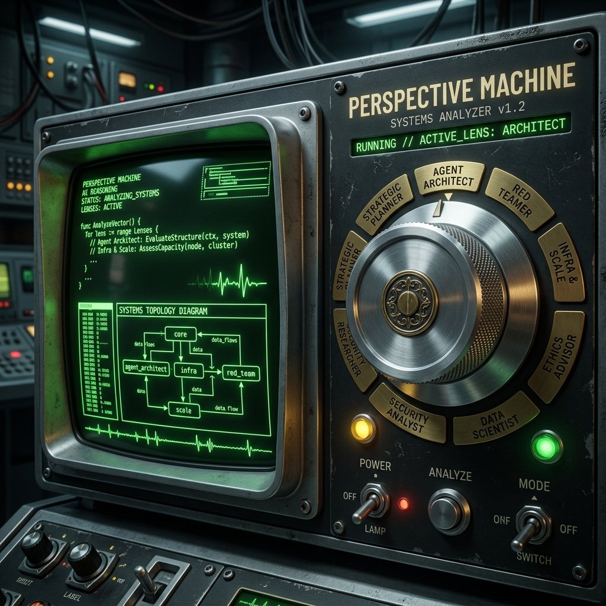
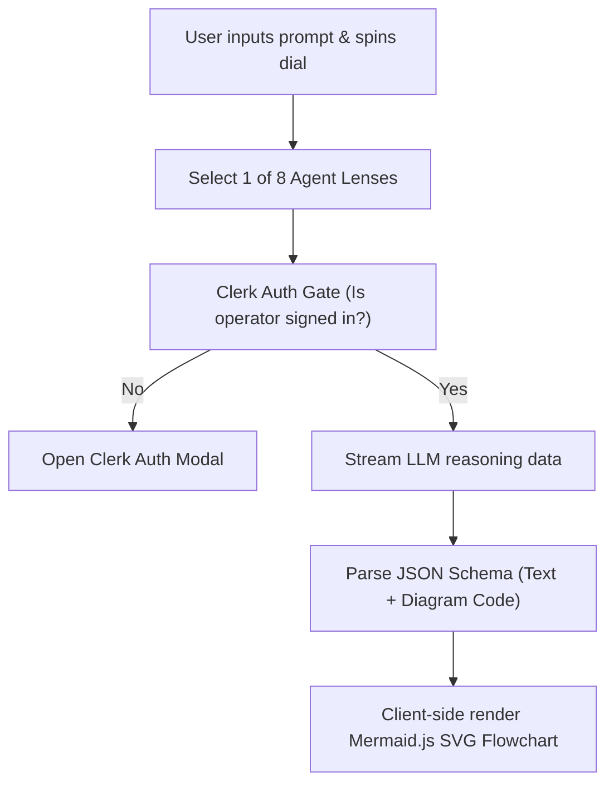

Was it a boring chat window with text bubbles? No, those are a complete vibe-kill.  
Did I build a retro, mid-century industrial terminal with a mechanical dial instead? Hell yes.

Brainstorming system architectures is a physical, multi-dimensional process. Instead of typing back-and-forth with a generic chatbot, **Perspective Machine** lets you spin a heavy, tactile rotary dial to different expert agent lens nodes (Agent Architect, Red Teamer, Infra & Scale) and synthesize system trade-offs.



---

## 😩 The Friction (Why Generic Chat UIs Suck)

Standard AI interfaces suffer from cognitive monotony:
* **Single-Stream Bias**: Chatbots give you one linear response stream, hiding alternative architectural viewpoints.
* **Lack of Tactile Feedback**: Digital interfaces feel flat and floaty without physical resistance or mass.
* **Unstructured Output**: Getting LLMs to output renderable block diagrams alongside text without breaking JSON formatting is a constant pain.

I wanted a specialized Agentic AI compiler where spinning a physical-feeling wheel shifts your perspective across system domains.

---

## ⚡ The Technical Blueprint (The Controls Engine)

The terminal coordinates user auth, agent routing, and visual diagram compilation seamlessly:



* **The Core**: Next.js App Router for static rendering speed and server actions.
* **The Auth Gate**: Clerk Auth for managing user sessions and rate limits.
* **Diagram Compiler**: Client-side **Mermaid.js** compilation converting structured JSON strings into inline SVG flowcharts.

---

## 💣 The Plot Twist (Spring Physics & Hydration Warnings)

To make the digital dial feel like a heavy, 1980s industrial rotary switch, standard ease-out CSS animations were out of the question—they feel fake and slide-y.

I used Framer Motion spring physics to simulate physical mass and friction:

```javascript
// Tuned spring settings for a heavy, mechanical wheel feel
const springSettings = {
    stiffness: 20, // Low stiffness prevents digital snaps
    damping: 13,   // Damping absorbs bounce, simulating metal weight
    mass: 1.2      // Extra mass makes the dial feel heavy to rotate
};
```

#### The Bug
Checking Clerk auth states synchronously on initial render threw constant Next.js **hydration mismatch warnings** because client auth states resolve asynchronously post-mount.

#### The Fix
Wrapped auth gates in client-side mounting hooks:

```javascript
const [mounted, setMounted] = useState(false);
useEffect(() => setMounted(true), []);

if (!mounted) return <SkeletonButton />;
if (!isSignedIn) return <SignInButton>Sign In to Explore</SignInButton>;
```

---

## 💡 Pro-Tips & Mental Models

> [!TIP]
> **Pro-Tip on UI Tactility**: Adjusting `mass` and `damping` in Framer Motion spring configs completely changes user perception. Higher mass adds weight, while controlled damping prevents springy rubber-band effects.

> [!NOTE]
> **Fun Fact on JSON Streaming**: When asking LLMs to generate text + Mermaid diagrams, always mandate a strict JSON schema containing a separate `"diagram"` field. Parsing markdown backticks from text streams fails 20% of the time!

---

## 🚀 Key Takeaways & Live Playground

* **Tactile UX Matters**: Adding physical spring physics makes digital tool exploration feel premium and engaging.
* **Hydration Boundaries**: Never evaluate client-only auth or window states during initial SSR rendering sweeps.
* **Visual Synthesis**: Structured JSON outputs make client-side SVG diagram compilation fast and reliable.

👉 **[Try Version 2.0 Live](https://perspective-machine-v2-0.vercel.app)**  
👉 **[Try Version 1.0 Live](https://perspective-machine-v1-0.vercel.app)**

---
