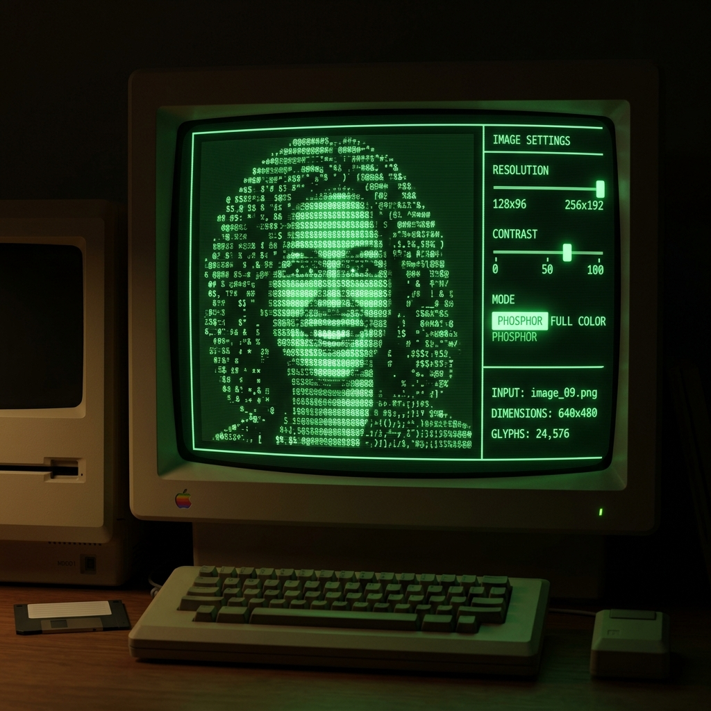
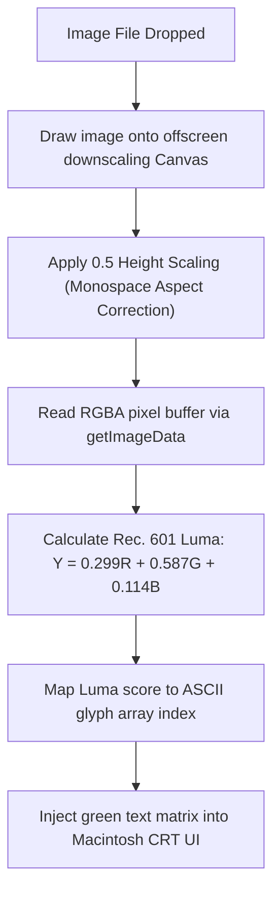

Was it built using heavy server compilers? No, pure browser canvas.  
Did it render in real-time at 60 FPS? Hell yes.

> *I vibe-coded this project at 1 AM after watching 1980s computing documentaries. I decided my profile picture was way too modern and needed to look like a green phosphor terminal scan running on a 1984 Macintosh.*

**Retro Mac CRT** is a client-side image compiler that lets you drop any photo into a 1984-era Macintosh chassis and watch it melt into phosphor-green or full-color ASCII text glyphs.



---

## 😩 The Friction (Modern Websites Are Too Flat)

Modern web design is obsessed with clean vector cards, flat colors, and subtle drop shadows.
* **Nostalgia Deficit**: Early computing had tactile character—scanlines, CRT phosphors, and monospace block characters.
* **Server Overhead**: Most image-to-ASCII converters send photos to backend servers, creating upload lag and privacy concerns.
* **Aspect Ratio Distortions**: Simple pixel-to-character mappers stretch images vertically because code fonts aren't square!

I wanted a zero-dependency, 100% browser-based ASCII compiler that converts photos on-the-fly at 60 FPS.

---

## ⚡ The Technical Blueprint (The ASCII Pipeline)

The entire conversion runs in-memory using offscreen HTML5 canvases and GPU box-filtering:



* **The Frontend**: React paired with Framer Motion for retro Macintosh chassis animations.
* **Downscaling Core**: Offscreen HTML5 canvas using GPU box-filtering.
* **Luma Engine**: Pure JavaScript calculating perceptual luminance weights over raw RGBA buffers.

---

## 💣 The Plot Twist (The Stretched Egg Aspect Ratio)

If you map an image pixel-for-pixel directly to text characters (e.g. a $100 \times 100$ image to $100 \times 100$ characters), the output gets stretched vertically by 200%—turning circular wheels into long vertical eggs!

Why? Monospace terminal characters aren't square. Code font characters are roughly **twice as tall as they are wide** ($1:2$ aspect ratio).

#### The Fix
During the offscreen canvas downscaling step, I scale the target height down by exactly half ($0.5$), letting the browser GPU handle the interpolation before sampling:

```typescript
const w = resolutionColumns; // e.g. 135 columns
const h = Math.round((img.height / img.width) * w * 0.5); // 0.5 height scale adjustment
```

---

## 💡 Pro-Tips & Mental Models

> [!TIP]
> **Pro-Tip on Color Conversion**: Never average RGB channels (`(R+G+B)/3`) for grayscale! The human eye is far more sensitive to green than blue. Always use the **Rec. 601 Luma formula**: $Y = 0.299R + 0.587G + 0.114B$.

> [!NOTE]
> **Fun Fact on CRT Monitors**: Old CRT screens used phosphor coatings that continued to glow briefly after being hit by electron beams. That iconic green streak is called "phosphor persistence"!

---

## 🚀 Key Takeaways & Live Playground

* **Leverage the GPU**: Offscreen canvas resizing is significantly faster than writing downscaling loops in JavaScript.
* **Typography Has Aspect Ratios**: Monospace font cells are $1:2$ rectangles, requiring height compensation during pixel sampling.
* **100% Client-Side**: Browser canvas readbacks can process high-resolution images locally without server costs.

👉 **[Try the CRT ASCII Converter Live](https://crt-ascii-converter.vercel.app/)**

---
