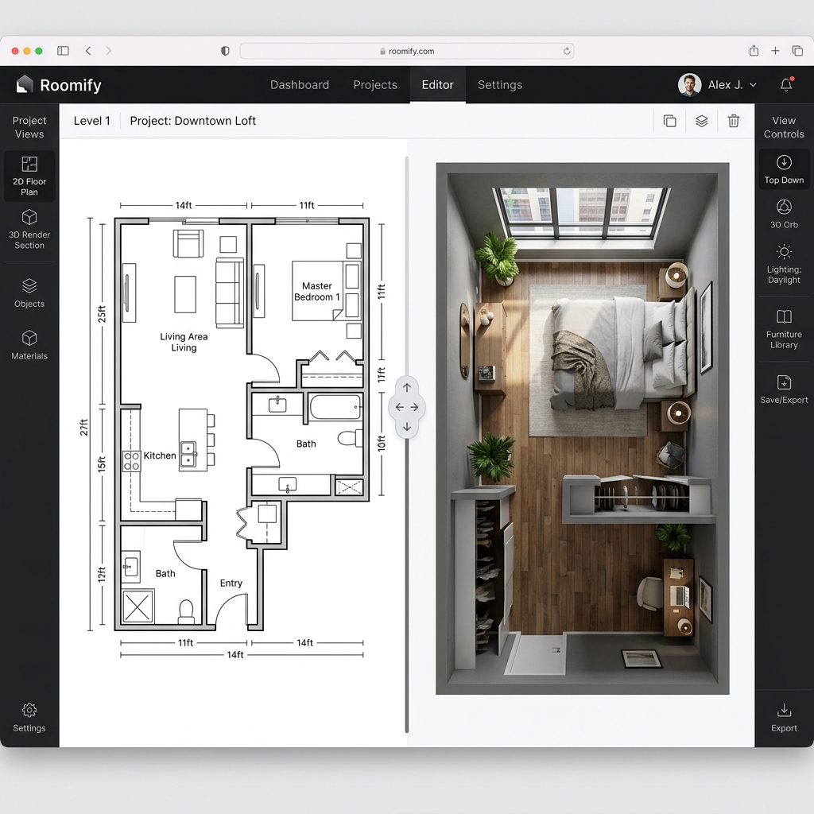
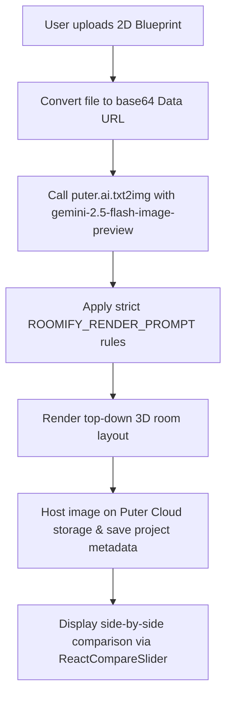

Was it simple? Yes.  
Did it cost me exactly $0 to host and run? Hell yes.

Whenever you look at a flat 2D blueprint, your brain has to do some heavy cognitive lifting to imagine what that space actually looks like. **Roomify** is a React web app that turns flat 2D floor plans into photorealistic, top-down 3D architectural renders in seconds using serverless cloud AI.



---

## 😩 The Friction (Cognitive Loads of 2D Layouts)

Translating flat lines into 3D spaces is a slow, manual process:
* **The CAD Tax**: Professional 3D rendering software requires hours of manual extrusion, object placements, and texturing.
* **Server Hosting Overhead**: Building image-to-image backends typically requires maintaining Node services, AWS S3 buckets, and database nodes.
* **Model Deviation**: Creative image models naturally want to make things artistic rather than geometrically precise.

I wanted a zero-backend, client-driven AI visualizer that processes architectural sketches directly in the browser.

---

## ⚡ The Technical Blueprint (The Serverless AI Pipeline)

All image files are processed, uploaded, and stored completely from the client browser using the Puter JS SDK:



* **Core SDK**: Puter.js for authentication, hosting, and serverless AI API calls.
* **AI Model**: Google's `gemini-2.5-flash-image-preview` for structural image-to-image generation.
* **Slider Sync**: `ReactCompareSlider` for side-by-side visual comparisons.

---

## 💣 The Plot Twist (The Prompt Engineering Nightmare)

Getting an image-to-image model to behave like an architectural compiler is a complete nightmare. By default, creative models want to make things "artsy"—they tilt cameras to dynamic cinematic angles or leave dimension letters floating on top of beds!

#### The Fix
I wrote a strict structural prompt in `ROOMIFY_RENDER_PROMPT` to enforce geometric rules:
* **Zero Text**: Removes all dimensions, text labels, and arrows.
* **Orthographic Camera Lock**: Enforces a strict top-down perspective with no tilt.
* **Structural Geometry Matching**: Walls and window segments must match the exact lines of the original sketch:

```typescript
const response = await puter.ai.txt2img(ROOMIFY_RENDER_PROMPT, {
    provider: "gemini",
    model: "gemini-2.5-flash-image-preview",
    input_image: base64Data, // Flat sketch source
    ratio: { w: 1024, h: 1024 }
});
```

---

## 💡 Pro-Tips & Mental Models

> [!TIP]
> **Pro-Tip on Serverless Backends**: Using cloud OS environments (like Puter) lets you build full-stack web applications with cloud storage, databases, and LLM access directly from frontend client code for $0.

> [!NOTE]
> **Fun Fact on AI Structure**: For accurate spatial mapping, text-to-image prompts fail. You must feed the original image as a structural guide to the model's canvas input.

---

## 🚀 Key Takeaways & Live Playground

* **Constrain Generative Models**: AI is chaotic by default. Enforce structural limits (camera angle, text removal) inside system prompts.
* **Serverless Speed**: Offload backend workflows to client-side SDKs to eliminate server costs.
* **Visual Verification**: Giving users side-by-side split screens makes evaluating AI accuracy intuitive.

👉 **[Try Roomify Live](https://itishacodes.github.io/Roomify/)**

---
