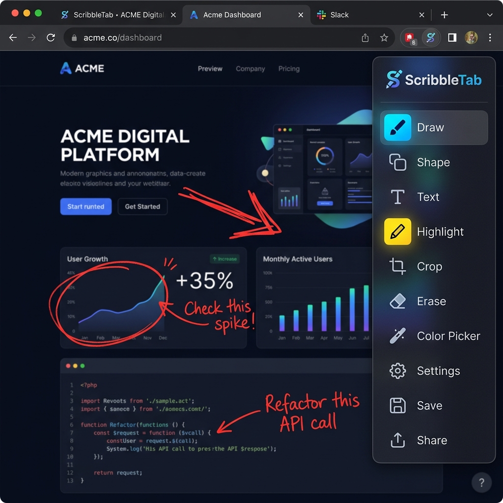
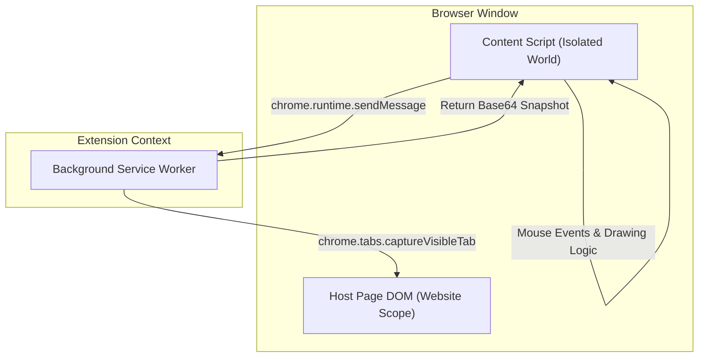

Was it a paint race condition? Yes.  
Did waiting 2 animation frames solve it with 0 lines of server code? Hell yes.

If you’ve ever tried to explain a complex UI bug or alignment issue to a teammate, you know taking screenshots, opening Slack or Figma, and drawing red markers is a massive friction loop. I built **ScribbleTab** so you can annotate, circle bugs, and copy composited screenshots directly to your clipboard right inside your browser window.



---

## 😩 The Friction (Why Existing Tools Sucked)

Most annotation tools force you into a bloated SaaS workflow:
* **Context Switching**: Take a screenshot ➔ Open Mac Preview or Figma ➔ Draw red boxes ➔ Export file ➔ Paste in Slack.
* **Heavy Memory Overhead**: Third-party desktop apps run heavy Electron wrappers just to draw a red arrow over a browser tab.
* **CSS Pollution**: Extension UIs injected directly into webpages often inherit or clash with the host site's global stylesheet rules.

I wanted a zero-overhead, Manifest V3 solution that layers an isolated viewport drawing surface over any website instantly.

---

## ⚡ The Technical Blueprint (The Engine Room)

Chrome Extensions operate in split execution environments to isolate security permissions and resource footprints. ScribbleTab divides its operations across three primary boundaries:



* **The Isolated World**: Content scripts share the webpage DOM tree, but run on a separate JavaScript heap. The host page cannot modify drawing coordinates, and extension variables never pollute global scopes.
* **Privileged Background Worker**: Content scripts cannot capture tab pixels. They serialize IPC messages to the Background Service Worker, which executes `chrome.tabs.captureVisibleTab` with elevated `activeTab` permissions.

---

## 💣 The Plot Twist (The Deflicker Paint Cycle)

When exporting drawings, the background service worker must capture the webpage and canvas paths, but **exclude** the floating toolbar dock.

Setting `display: none` on the toolbar and immediately triggering a screenshot failed. Browser layout paint cycles run asynchronously to JavaScript execution, so the capture API grabbed pixels *before* the layout engine processed the visual reflow—leaving a ghost toolbar in the final image!

#### The Fix
By nesting `requestAnimationFrame` (rAF) callbacks, we force JavaScript execution to yield, guaranteeing the layout engine completes two paint sweeps before capturing the tab:

```javascript
// 1. Instantly hide floating toolbar
toolbar.style.display = 'none';

// 2. Yield execution twice to guarantee browser layout reflow
await new Promise(resolve => requestAnimationFrame(resolve));
await new Promise(resolve => requestAnimationFrame(resolve));

// 3. Dispatch capturing message to background service worker
const response = await chrome.runtime.sendMessage({ type: 'CAPTURE_TAB' });
```

---

## 💡 Pro-Tips & Mental Models

> [!TIP]
> **Pro-Tip on Event Loops**: Nesting `requestAnimationFrame` calls is like calling `await delay(16ms)`, but perfectly synchronized with your monitor's native refresh rate. It forces the browser rendering engine to finish painting layout changes before your next line of JS runs.

> [!NOTE]
> **Fun Fact on Manifest V3**: Background service workers in MV3 are ephemeral—they terminate after 30 seconds of inactivity to save RAM. Never store long-term state in global JS variables; always use `chrome.storage`!

---

## 🚀 Key Takeaways & Live Playground

* **Isolate Execution**: Use Manifest V3 isolated worlds and Shadow DOM roots to protect your extension UI from host page CSS.
* **Synchronize Paints**: Never trigger visual captures immediately after changing DOM visibility. Yield to the browser render loop with `requestAnimationFrame`.
* **Zero Overhead**: Dynamic script injections keep memory footprints at zero until the user actually activates the extension.

👉 **[Inspect the Code on GitHub](https://github.com/itishacodes/ScribbleTab)**

---
