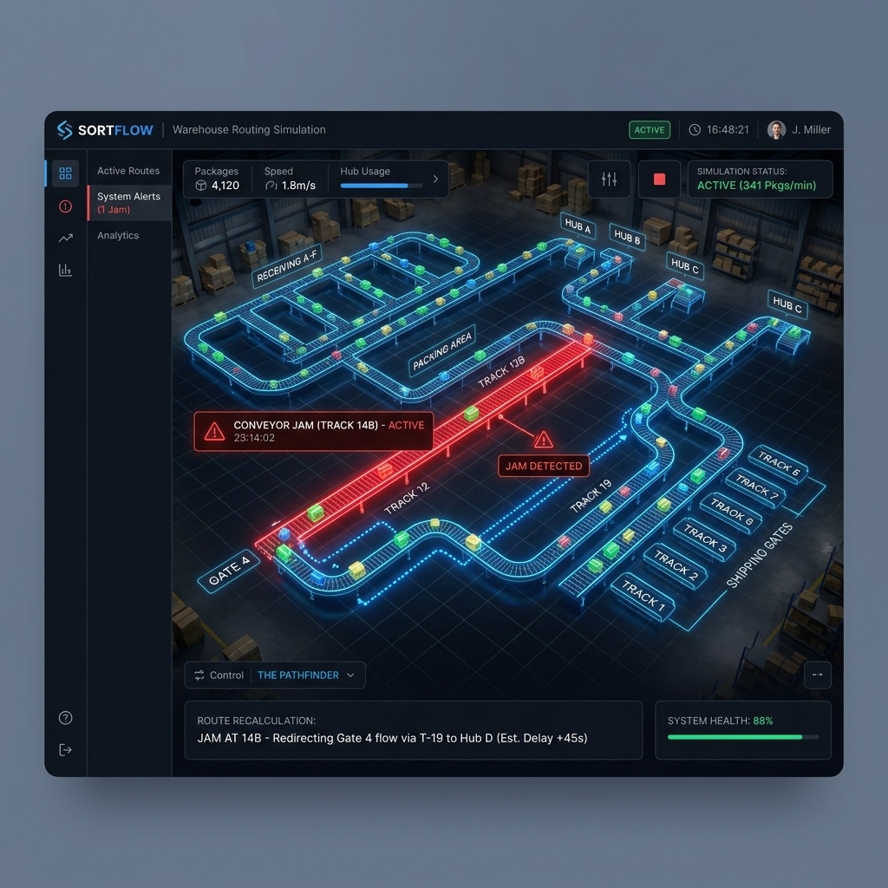
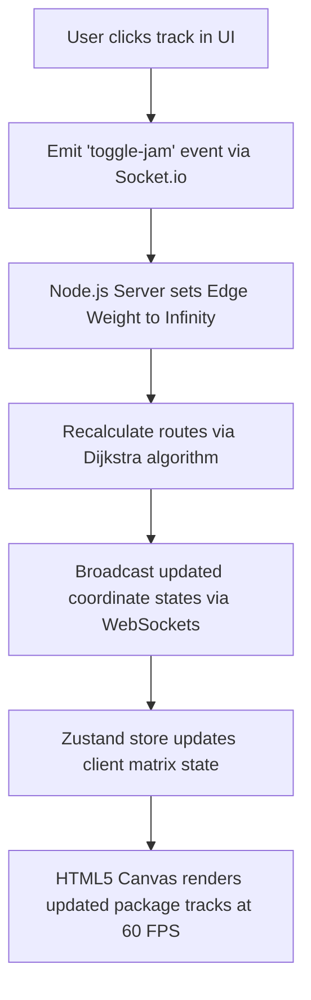

Was it complex? Yes.  
Did it calculate paths and dynamically reroute packages in under 2ms? Hell yes.

In modern logistics hubs, packages move along complex networks of conveyor tracks. **SortFlow** is an interactive, real-time 2D warehouse layout simulator featuring dynamic pathfinding, user-triggered conveyor jams, and live logging.



---

## 😩 The Friction (Warehouse Gridlocks & Laggy DOMs)

Logistics monitoring software is often slow and hard to visualize:
* **Conveyor Jams**: A single conveyor blockage can ripple and crash an entire routing system unless nodes recalculate path weights instantly.
* **DOM Lag**: Rendering dozens of packages moving independently along bezier paths using standard React DOM nodes quickly lags the browser thread.
* **Client/Server Drift**: Keeping coordinates in sync between multiple monitors requires high-resolution server coordination.

I wanted a 60 FPS visual dashboard that handles dynamic rerouting and WebSocket synchronization.

---

## ⚡ The Technical Blueprint (The Traffic Controller)

SortFlow is designed as a split-process client/server monorepo. It offloads physics to a server clock and renders using optimized canvas loops:



* **The Backend**: Node.js/Express server managing a high-resolution simulation clock and routing graph.
* **The Communication**: Persistent WebSockets using **Socket.io** to broadcast state updates at 60Hz.
* **The Frontend**: React wrapper using **Zustand** for transient state storage, rendering graphics directly onto an HTML5 Canvas context.

---

## 💣 The Plot Twist (The Rerouting State Loop)

Normally, Dijkstra path edge weights match track pixel lengths. Toggling a "conveyor jam" sets the target edge weight to `Infinity`.

During early tests, when a track jammed, packages traversing that specific segment got stuck in an infinite state loop. The pathfinder tried to recalculate a path *from* their current coordinates, saw they were sitting on a jammed track with `Infinity` weight, and entered an infinite loop trying to escape, freezing the server!

#### The Fix
I split rerouting logic into two distinct execution branches:
1. **Mid-Track Packages**: If a package is already on the jammed track, it pauses movement and waits.
2. **Junction-Bound Packages**: If a package is sitting at a node, the pathfinder immediately skips neighbor tracks with `Infinity` weight:

```typescript
// Skip neighbors if the track is jammed (weight equals Infinity)
const weight = map.getEffectiveWeight(currentNodeId, neighborId);
if (weight === Infinity) continue;

const alternateDistance = minDistance + weight;
```

<style>
  :root {
    --dj-primary: #1d4ed8;
    --dj-primary-glow: rgba(29, 78, 216, 0.15);
    --dj-btn-bg: rgba(29, 78, 216, 0.08);
  }
  :root[saved-theme="dark"] {
    --dj-primary: #44aaff;
    --dj-primary-glow: rgba(68, 170, 255, 0.3);
    --dj-btn-bg: rgba(68, 170, 255, 0.15);
  }
</style>

<div class="dijkstra-sandbox-container" onmouseenter="ensureDijkstraInit(this)" ontouchstart="ensureDijkstraInit(this)" style="background: var(--light); border: 1px solid var(--lightgray); border-radius: 12px; padding: 20px; margin: 24px auto; font-family: var(--font-mono, monospace); color: var(--dark); max-width: 360px; box-shadow: 0 4px 15px rgba(0,0,0,0.08); transition: background 0.3s ease, border-color 0.3s ease, color 0.3s ease;">
  <h4 style="margin: 0 0 12px 0; color: var(--dj-primary); text-shadow: 0 0 10px var(--dj-primary-glow); font-size: 14px; text-transform: uppercase; letter-spacing: 2px; border: none; padding: 0; transition: color 0.3s ease;">⚡ conveyor dijkstra pathfinder</h4>
  <p style="font-size: 11px; color: var(--text-dim); margin-bottom: 16px; border: none; padding: 0;">Click grid cells to toggle conveyor jams (red blocks). The algorithm dynamically recalculates the shortest path (blue line) to avoid the blocked tracks.</p>
  
  <div style="display: flex; justify-content: center; margin-bottom: 16px;">
    <div id="dijkstra-grid" style="display: grid; grid-template-columns: repeat(5, 40px); grid-template-rows: repeat(5, 40px); gap: 6px; background: var(--bg); padding: 8px; border: 1px solid var(--lightgray); border-radius: 6px; transition: background 0.3s ease, border-color 0.3s ease;">
    </div>
  </div>
  
  <div style="display: flex; gap: 8px; justify-content: space-between; align-items: center; font-size: 10px;">
    <div style="display: flex; gap: 6px;">
      <span style="display: inline-block; width: 8px; height: 8px; background: #33ff88; border-radius: 2px;"></span> Start
      <span style="display: inline-block; width: 8px; height: 8px; background: #ff4466; border-radius: 2px; margin-left: 6px;"></span> Jam
      <span style="display: inline-block; width: 8px; height: 8px; background: #ffaa33; border-radius: 2px; margin-left: 6px;"></span> Dest
    </div>
    <button onclick="resetDijkstraGrid()" style="padding: 4px 8px; background: var(--dj-btn-bg); border: 1px solid var(--dj-primary); color: var(--dj-primary); border-radius: 4px; font-size: 9px; cursor: pointer; font-family: monospace; transition: all 0.3s ease;">Reset Jams</button>
  </div>
</div>

<script>
  const djSize = 5;
  let djStart = 0;
  let djEnd = 24;
  let djJams = new Set();
  
  function getDjGrid() {
    return document.getElementById('dijkstra-grid');
  }
  
  function ensureDijkstraInit(el) {
    if (el.dataset.init) return;
    el.dataset.init = "true";
    resetDijkstraGrid();
    
    const djObserver = new MutationObserver(() => {
      renderDijkstraGrid();
    });
    djObserver.observe(document.documentElement, { attributes: true, attributeFilter: ['saved-theme'] });
  }
  
  function resetDijkstraGrid() {
    djJams.clear();
    renderDijkstraGrid();
  }
  
  function toggleDjCell(idx) {
    if (idx === djStart || idx === djEnd) return;
    if (djJams.has(idx)) {
      djJams.delete(idx);
    } else {
      djJams.add(idx);
    }
    renderDijkstraGrid();
  }
  
  function runDijkstra() {
    const dist = new Array(djSize * djSize).fill(Infinity);
    const prev = new Array(djSize * djSize).fill(null);
    const unvisited = new Set(Array.from({ length: djSize * djSize }, (_, i) => i));
    
    dist[djStart] = 0;
    
    while (unvisited.size > 0) {
      let current = -1;
      let minDist = Infinity;
      for (const node of unvisited) {
        if (dist[node] < minDist) {
          minDist = dist[node];
          current = node;
        }
      }
      
      if (current === -1 || current === djEnd) break;
      unvisited.delete(current);
      
      const r = Math.floor(current / djSize);
      const c = current % djSize;
      const neighbors = [];
      
      if (r > 0) neighbors.push(current - djSize);
      if (r < djSize - 1) neighbors.push(current + djSize);
      if (c > 0) neighbors.push(current - 1);
      if (c < djSize - 1) neighbors.push(current + 1);
      
      for (const n of neighbors) {
        if (!unvisited.has(n) || djJams.has(n)) continue;
        const alt = dist[current] + 1;
        if (alt < dist[n]) {
          dist[n] = alt;
          prev[n] = current;
        }
      }
    }
    
    const path = [];
    let curr = djEnd;
    if (dist[curr] !== Infinity) {
      while (curr !== null) {
        path.push(curr);
        curr = prev[curr];
      }
      path.reverse();
    }
    return path;
  }
  
  function renderDijkstraGrid() {
    const grid = getDjGrid();
    if (!grid) return;
    
    const path = runDijkstra();
    const pathSet = new Set(path);
    const isDark = document.documentElement.getAttribute('saved-theme') === 'dark';
    
    grid.innerHTML = "";
    for (let i = 0; i < djSize * djSize; i++) {
      const cell = document.createElement('div');
      cell.setAttribute('onclick', `toggleDjCell(${i})`);
      cell.style.width = '40px';
      cell.style.height = '40px';
      cell.style.borderRadius = '4px';
      cell.style.cursor = 'pointer';
      cell.style.transition = 'all 0.2s';
      cell.style.display = 'flex';
      cell.style.justifyContent = 'center';
      cell.style.alignItems = 'center';
      cell.style.fontSize = '12px';
      
      if (i === djStart) {
        cell.style.background = isDark ? '#33ff88' : '#059669';
        cell.style.color = '#ffffff';
        cell.textContent = "⚙️";
      } else if (i === djEnd) {
        cell.style.background = isDark ? '#ffaa33' : '#d97706';
        cell.style.color = '#ffffff';
        cell.textContent = "📦";
      } else if (djJams.has(i)) {
        cell.style.background = isDark ? '#ff4466' : '#dc2626';
        cell.style.boxShadow = isDark ? '0 0 8px rgba(255,68,102,0.4)' : 'none';
        cell.style.color = '#ffffff';
        cell.textContent = "❌";
      } else if (pathSet.has(i)) {
        cell.style.background = isDark ? 'rgba(68,170,255,0.2)' : 'rgba(29,78,216,0.1)';
        cell.style.border = isDark ? '1px dashed #44aaff' : '1px dashed #1d4ed8';
        cell.style.boxShadow = isDark ? '0 0 4px rgba(68,170,255,0.2)' : 'none';
        cell.style.color = isDark ? '#44aaff' : '#1d4ed8';
        cell.textContent = "✦";
      } else {
        cell.style.background = isDark ? 'rgba(255,255,255,0.04)' : 'rgba(0,0,0,0.02)';
        cell.style.border = isDark ? '1px solid rgba(255,255,255,0.08)' : '1px solid rgba(0,0,0,0.06)';
      }
      grid.appendChild(cell);
    }
  }
</script>

---

## 💡 Pro-Tips & Mental Models

> [!TIP]
> **Pro-Tip on Rendering Performance**: Avoid React state updates for fast-moving items. Bind canvas rendering directly to high-performance store listeners (like Zustand transient updates) to bypass DOM reconciler overhead.

> [!NOTE]
> **Fun Fact on Network Clocks**: High-speed simulation sync works best when coordinates are calculated on a server clock loop and broadcast to frontends, keeping screen states identical.

---

## 🚀 Key Takeaways & Live Playground

* **Isolate Animation Calculations**: Avoid DOM updates for moving systems; canvas elements redraw complex grids at 60 FPS easily.
* **Transient State Storage**: Use lightweight state stores like Zustand to decouple calculations from React rendering sweeps.
* **Skip Incomplete Paths**: Handle jammed weights at the edge evaluation stage to prevent infinite search loops.

👉 **[Try the Warehouse Simulation Live](https://sortflow-sim.vercel.app)**

---
