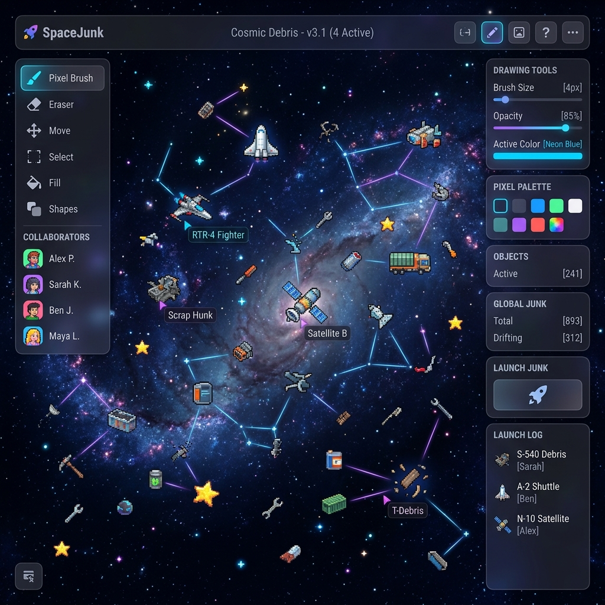
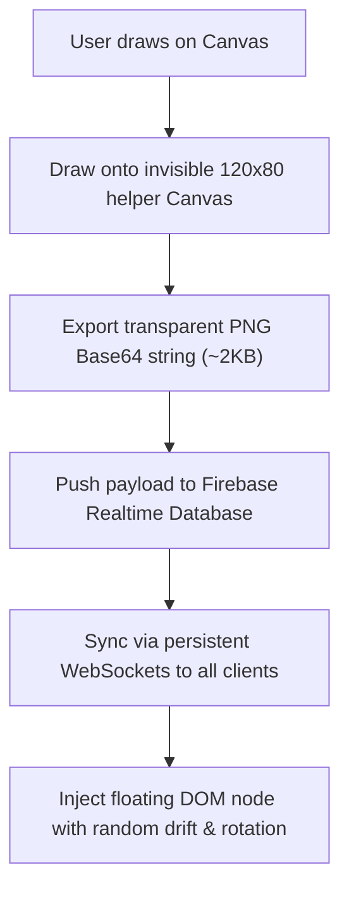

Was it a heavy enterprise dashboard? No, I was bored of that.  
Did I build a collaborative trash heap in space instead? Hell yes.

We dump so much garbage on the internet—memes, random text files, half-baked jokes—and once uploaded, it drifts in the digital void forever. **SpaceJunk** is an interactive galaxy canvas where anyone can draw custom cosmic debris, name it, and launch it to drift across everyone else’s screens in real-time.



---

## 😩 The Friction (Digital Trash Has No Place to Live)

Most real-time collaborative whiteboards are built for boring enterprise work:
* **Payload Bloat**: High-resolution drawings sent across real-time databases quickly blow through bandwidth limits.
* **Latency Lags**: Standard HTTP polling creates annoying delay spikes when syncing drawing updates across users.
* **Security Exposure**: Exposing database write keys in client-side scripts invites spammers and script kiddies to wipe the database.

I wanted a lightweight, real-time galaxy canvas where drawings sync instantly across active clients without high database bills.

---

## ⚡ The Technical Blueprint (The Cosmic Sync Engine)

Drawings move from a user's cursor to everyone else's browser screen via an offscreen downsampling pipeline and WebSockets:



* **Storage Engine**: Firebase Realtime Database (RTDB) for persistent WebSocket speed.
* **Downsampling Core**: Offscreen HTML5 canvas rasterizer reducing drawing sprites.
* **Client Renderer**: CSS animated DOM elements floating along randomized space trajectories.

---

## 💣 The Plot Twist (The 500KB Payload Blowout)

Early in testing, I grabbed raw canvas drawings using `canvas.toDataURL()`. I hit export, looked at the network tab, and froze: the base64 string was **500KB+**!

Pushing half-megabyte payloads to a real-time database every single time someone launched a drawing would lag clients and blow through free-tier database limits in minutes.

#### The Fix
I built a two-stage downscaling pipeline. When a user clicks "Launch," the drawing is drawn onto a hidden $120 \times 80$ pixel canvas. The browser's GPU downsamples the graphics, converting the output into a tiny **2KB** micro-sprite:

```javascript
// Create a tiny helper canvas for compression
const small = document.createElement('canvas');
small.width = 120; small.height = 80;
const ctx = small.getContext('2d');

// Downscale main drawing to 120x80 micro-sprite
ctx.drawImage(mainCanvas, 0, 0, 120, 80);
const imageData = small.toDataURL('image/png'); // ~2KB output
```

---

## 💡 Pro-Tips & Mental Models

> [!TIP]
> **Pro-Tip on WebSockets vs HTTP**: For real-time canvas updates under 100ms, persistent WebSocket connections (like Firebase RTDB) beat standard HTTP polling every time.

> [!NOTE]
> **Fun Fact on Database Security**: You can write-lock Firebase NoSQL nodes using Security Rules so users can *create* items, but can *never edit or delete* existing entries: `".write": "!data.exists() && newData.exists()"`.

---

## 🚀 Key Takeaways & Live Playground

* **Compress at the Source**: Let the client GPU downsample drawings before sending data over the wire.
* **WebSockets for Latency**: Use persistent socket connections for sub-second collaborative syncing.
* **Secure Client Keys**: Restrict GCP API keys by domain and lock NoSQL write capabilities at the database rule layer.

👉 **[Launch SpaceJunk Live](https://itishacodes.github.io/SpaceJunk/)**

---
