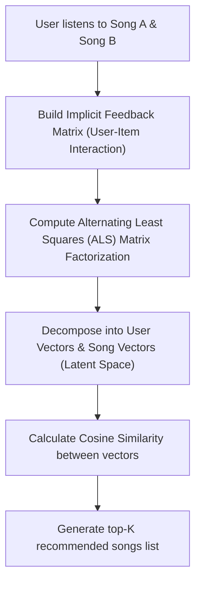

People are writing massive research papers on deep learning recommendation models. 

Honestly, I just wanted to know why my Spotify Discover Weekly knows exactly when I’m having a mid-week crisis and plays the perfect indie rock track.

It turns out Spotify doesn't just guess. Under the hood, their recommendation system is a massive data pipeline combining three distinct algorithm frameworks: Collaborative Filtering, Natural Language Processing (NLP), and Raw Audio Analysis.

Here is a breakdown of how they map your music taste using Collaborative Filtering and Matrix Factorization math.

---

### the recommendation pipeline

Here is how your listening history compiles into a custom Discover Weekly playlist:



---

### the implicit feedback matrix

To make recommendations, Spotify needs to know what you like. But most users don't rate every song they hear. 

So, Spotify builds an **implicit feedback matrix** where actions speak louder than stars:
* Skipping a song before 30 seconds = Negative weight ($-1$).
* Listening to the end = Positive weight ($+1$).
* Repeating a track = Heavy positive weight ($+5$).

This creates a massive grid where rows represent users and columns represent songs. Since you’ve only listened to a fraction of the 100 million songs on the platform, $99.9\%$ of this matrix is empty (a sparse matrix).

---

### matrix factorization: finding hidden tastes

To fill in the gaps, Spotify uses **Collaborative Filtering** driven by **Matrix Factorization**. 

The goal is to decompose the giant, sparse User-Song matrix $R$ into two smaller, dense matrices: a User matrix $U$ and a Song matrix $V$, mapping both into a shared "latent space" of coordinates (e.g. 40 dimensions representing factors like acousticness, energy, or sub-genres):

$$R \approx U \times V^T$$

To calculate these coordinates, they run **Alternating Least Squares (ALS)**. Because the mathematical cost of calculating millions of users and songs simultaneously is a complete computation disaster, ALS fixes the User matrix and solves for the Song matrix, then alternates—fixing the Song matrix and solving for the User matrix.

Once every user and song has a coordinate vector (e.g. `user_vector` and `song_vector`), Spotify calculates how close they are in space using **Cosine Similarity**:

$$\text{Similarity} = \frac{A \cdot B}{\|A\| \|B\|}$$

```
was it deep learning? no, just linear algebra.
did it predict that I wanted to listen to lofi indie rock at 3 AM? Hell yes.
```

Spotify's recommendation engine is a beautiful lesson in handling sparse matrices, vector similarities, and data scaling. Let me know what your Discover Weekly plays next!
